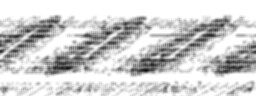
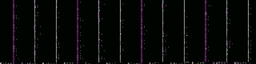
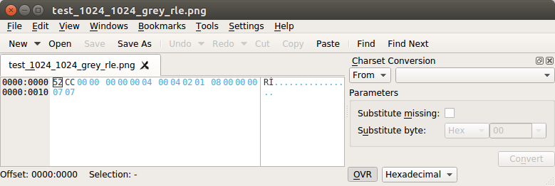

[PDF version](18bytes.pdf) ([LaTeX template](template.tex))

# \*bleed continues: 18 byte file, $14k bounty, for leaking private Yahoo! Mail images

by Chris Evans, Thursday, May 18, 2017

# Overview

\*bleed attacks are hot right now.
Most notably, there's been [Heartbleed](https://en.wikipedia.org/wiki/Heartbleed) and [Cloudbleed](https://en.wikipedia.org/wiki/Cloudbleed).
In both cases, out-of-bounds reads in server side code resulted in private server memory content being returned to clients.
This leaked sensitive secrets from the server process' memory space, such as keys, tokens, cookies, etc.
There was also a recent [client-side bleed in Microsoft's image libraries](https://bugs.chromium.org/p/project-zero/issues/detail?id=992),
exposed through Internet Explorer.
One of the reason \*bleed attacks are interesting is that they are not affected by most sandboxing, and they are relatively easy to exploit.

Presented here is Yahoobleed \#1 (YB1),
a way to slurp other users' private Yahoo! Mail image attachments from Yahoo servers.

YB1 abuses an 0-day I found in the [ImageMagick](https://www.imagemagick.org/script/index.php) image processing software.
This vulnerability is now a so-called 1-day,
because I promptly reported it to upstream ImageMagick and provided a 1-line patch to resolve the issue,
which [landed here](http://git.imagemagick.org/repos/ImageMagick/commit/1c358ffe0049f768dd49a8a889c1cbf99ac9849b).
You can refer to it as CESA-2017-0002.

The previous \*bleed vulnerabilities have typically been out-of-bounds reads,
but this one is the use of uninitialized memory.
An uninitialized image decode buffer is used as the basis for an image rendered back to the client.
This leaks server side memory.
This type of vulnerability is fairly stealthy compared to an out-of-bounds read because the server will never crash.
However, the leaked secrets will be limited to those present in freed heap chunks.

# Yahoo! response

The Yahoo! response has been one of best I've seen. In order:

1. They have a bug bounty program, which encourages and rewards security research and fosters positive hacker relations, etc.
1. Upon receiveing a bug, they serve a 90-day response deadline on themselves.
This is very progressive and the polar opposite of e.g. Microsoft,
who occasionally like to turn reasonable disclosure deadlines into a pointless fight.
1. And indeed the bug was fixed well within 90 days.
1. The communication was excellent, even when I was sending far too many ping requests.
1. The fix was particularly thorough: **ImageMagick was retired**.
1. A robust bounty of $14,000 was issued (for this combined with a similar issue, to be documented separately). $778 per byte -- lol!
1. I'm donating this reward to charity. Upon being asked about charitable matching,
**Yahoo! accepted a suggestion to match (i.e. double) the reward to $28,000**.
1. 

# Demos

The attack vector for these demos was to attach the 18-byte exploit file (or a variant) as a Yahoo! Mail attachment,
send it to myself, and then click on the image in the received mail to launch the image preview pane.
The resulting JPEG image served to my browser is based on uninitialized, or previously freed, memory content.

*The following three images have had entropy stripped from them via a variety of transforms. Originals have been destroyed.*



In image \#1, you can see the capital letter A inside a black circle.
Imagine suddenly and unexpectedly seeing this in a returned image while investigating a vulnerability you expected to be boring!
There are various possible reasons for the repeated nature of the recovered image -- assuming the original in-memory image does not consist of a repeated nature.

Most obviously, the in-memory image dimensions probably don't match the dimensions of our uninitialized canvas,
1024x1024 in this particular case. Depending on how the in-memory image is stored,
this will lead to repetition and / or offsetting as both seen here.

Also, the in-memory image representation might not match the colorspace,
colorspace channel order or alpha channel status (yes or no) of the uninitialized RLE decode canvas.
The thumbnail decode and re-encode pipeline will leave all sorts of different in memory artifacts in the course of doing its job.

Don't be in any doubt though: correct reconstruction of the original image would be possible,
but that's a non-goal.


In image \#2, you might still be able to make out the remains of a human face.
Perhaps a forehead, perhaps a nose and even a forehead and cheekbone? Or maybe not,
because of the stripping of entropy and transforms applied. But you can appreciate that at the time,
seeing a random face was a shock and illustrated the severity of the leak.
At that point, I ceased, desisted, destroyed all files based on uninitialized memory and reported the bug.



In image \#3, the color has been left in because the image shows interesting vertical bands of magenta, SkyBlue and yellow.
What in-memory structure leads to this pattern? I have no idea.
At first I was thinking some CMYK colorspace representation but I don't think that makes sense.
JPEGs are typically coded in the [YCbCr colorspace](https://en.wikipedia.org/wiki/YCbCr),
so perhaps a partially encoded or decoded JPEG is involved.

# The vulnerability

The vulnerability exists in the obscure RLE (Utah Raster Toolkit Run Length Encoded) image format,
which previously featured in my [blog post noting memory corruption in box.com](https://scarybeastsecurity.blogspot.com/2017/03/black-box-discovery-of-memory.html).
The new ImageMagick 0-day is in this code snippet here, from `coders/rle.c`:

```
    pixel_info_length=image->columns*image->rows*
      MagickMax(number_planes_filled,4);
    pixels=(unsigned char *) GetVirtualMemoryBlob(pixel_info);
    if ((flags & 0x01) && !(flags & 0x02))
      {
[...]
        /*
          Set background color.
        */
        p=pixels;
        for (i=0; i < (ssize_t) number_pixels; i++)
        {
[...]
            {
              for (j=0; j < (ssize_t) (number_planes-1); j++)
                *p++=background_color[j];
              *p++=0;  /* initialize matte channel */
            }
        }
      }
    /*
      Read runlength-encoded image.
    */
[...]
    do
    {
      switch (opcode & 0x3f)
[...]
      opcode=ReadBlobByte(image);
    } while (((opcode & 0x3f) != EOFOp) && (opcode != EOF));
```


It's a tricky vulnerability to spot because of the abstraction
and also because this is a vulnerability caused by the absence of a necessary line of code,
not the presence of a buggy line of code.
The logic is approximately:

1. Allocate a suitably sized canvas for the image decode.
Note that the `GetVirtualMemoryBlob` call does NOT guarantee zero-filled memory,
as you would expect if it were backed by `mmap()`. It's just backed by `malloc()`.
1. Depending on some image header flags, either initialize the canvas to a background color, or don't.
1. Iterate a loop of RLE protocol commands, which may be long or may be empty.
1. After this code snippet, the decoded canvas is handed back to the ImageMagick pipeline for whatever processing is underway.

As you can now see, the attacker could simply create an RLE image that has header flags that do not request canvas initialization,
followed by an empty list of RLE protocol commands.
This will result in an uninitialized canvas being used as the result of the image decode.
Here's an RLE file that accomplishes just that. It's just 18 bytes!



And these 18 bytes parse as follows:

```
52 CC:        header
00 00 00 00:  top, left at 0x0.
00 04 00 04:  image dimensions 1024 x 1024
02:           flags 0x02 (no background color)
01:           1 plane (i.e. grayscale image)
08:           8 bits per sample
00 00 00:     no color maps, 0 colormap length, padding
07:           end of image (a protocol command is consumed pre-loop)
07:           end of image (end the decode loop for real)
```

There are a few bytes that are important for experimentation of exploitation:
the number of planes (i.e. a choice between a greyscale vs. a color image),
and the image dimensions, which determine the size of the unininitialized `malloc()` chunk.

# Exploitation

Exploitation is an interesting discussion.
Here are some of the factors that affect exploitation of this vulnerability, both generally and in the Yahoo! case specifically:


- *Decoder lockdown*.
Yahoo! did not appear to implement any form of whitelisting for only sane ImageMagick decoders.
RLE is not a sane decoder on the modern web.
Anyone using ImageMagick really needs to lock down the decoder list to just the ones needed.

- *Sandboxing*.
As noted above, sandboxing doesn't have much of an effect on this vulnerability type.
Although it doesn't make much difference,
my best guess is that the server in question might be using Perl and PerlMagick,
as well as handling various network traffic,
suggesting that a tight sandbox policy is difficult without extensive refactoring.

- *Process isolation*. This is critical.
\*bleed bugs for most usages of ImageMagick are mostly harmless
because it's typical to kick off e.g. a thumbnail request by launching the ImageMagick convert binary,
once per thumbnail request.
This means that the process memory space of the exploited process is only likely to contain the attacker's image data,
making exploitation much less interesting (but not irrelevant as we saw in my recent Box and DropBox blog posts).

  The Yahoo! Mail process which is handling thumbnailing has an unusual property, though:
**it appears to be long lived and to process images from a variety of different users**.
Suddenly, a memory content leak is a very serious vulnerability.

- *Heap implementation*. The heap implementation used is significant.
For the input RLE file decomposed above, the canvas allocation is 1024 x 1024 x 4, or 4MB.
This is large allocation and for example,
the default `malloc()` tuning on Linux x86_64 leads to such a large allocation being satisfied by `mmap()`,
which zero-fills memory and will not lead to interesting memory content leakage!
However, we definitely see leaked heap content with such a large allocation in the Yahoo! context,
so a non-default heap setup is clearly in use. With our ability to leak heap content,
we could likely fingerprint the exact heap implementation if we cared to do so.
Who knows, maybe we'd find tcmalloc or jemalloc, both popular allocators with large service providers.

- *Thumbnail dimensions*. It's worth a brief note on thumbnail dimensions.
If we're in a situation where our uninitialized canvas gets resized down to a smaller thumbnail,
this would compress out detail from the original leaked memory content.
This would spoil certain exploitation attempts.
However, Yahoo! Mail's preview panel seems to display very large images (tested to 2048x2048) verbatim, so no worries here.

- *Thumbnail compression*. This one is interesting.
Yahoo! Mail returns thumbnails and image previews as JPEG images.
As we know, JPEG compression is lossy.
This is not a particular issue if we're only interested in pulling image data out of Yahoo! servers.
But if we're interested in looking at raw bytes of Yahoo! server memory, then lossy compression is losing us data.

  As an example of this, I tried to extract concrete pointer values from memory dumps -- perhaps we want to remotely defeat ASLR?
I used greyscale images because JPEG compresses color data more than it compresses intensity data.
But still, with a 16-byte sized data exfiltration I see pointer values such as `0x020081c5b0be476f` and `0x00027c661ac2722a`.
Hmm. You can see that these may be trying to be Linux x86_64 user space pointers (`0x00007f....`) but there's a lot of information loss there.

I think it would be possible to overcome this exfiltration problem.
Most likely, there's some thumbnailing endpoint that returns (or can be asked to return with some URL parameter) lossless PNG images,
which would do the trick. Or for the brave, mathematical modelling of JPEG compression??

# Conclusions

Broadly: in a world of decreasing memory corruption and increasing sandboxing,
\*bleed bugs provide a compelling option for easily stealing information from servers.


On design: taking a long running process and linking in ImageMagick as a library has to be a discouraged design choice,
as it takes bugs that might not be very serious and makes them very serious indeed.
Limiting ImageMagick decoders to a minimal required set is a must for any processing of untrusted input.

GraphicsMagick vs. ImageMagick, again. Well, well, look at this :)
GraphicsMagick fixed this issue in March 2016, for the v1.3.24 release,
tucked away [in a changeset](http://hg.code.sf.net/p/graphicsmagick/code/diff/0a5b75e019b6/coders/rle.c)
titled "Fix SourceForge bug" #371 "out-of-bounds read in coders/rle.c:633:39" (see the second `memset()`).
This is another case where tons of vulnerabilities are being found and fixed in both GraphicsMagick and ImageMagick with little co-ordination.
This seems like a waste of effort and a risk of 0-day (or is it 1-day?) exposure.
It goes both ways: the RLE memory corruption I referenced in my previous blog post
was only [fixed in GraphicsMagick in March 2016](http://hg.code.sf.net/p/graphicsmagick/code/diff/c6a6ea253a35/coders/rle.c),
having been previously [fixed in ImageMagick in Dec 2014](http://git.imagemagick.org/repos/ImageMagick/commit/7131d8ff451a1d5163e7e35b7a910df80cb54fab).

Linux distributions:This vulnerability is now 1-day in the sense that it is broadly unpatched by entities that repackage upstream ImageMagick,
such as Linux distributions.
(As a side note, it's worth noting that the RLE decoder in Ubuntu 16.04 LTS is totally borked
due to a bogus check that can be seen [getting removed here](https://github.com/ImageMagick/ImageMagick/commit/f739cf56af7383b13d8e7b39961c27948fa14876#diff-04a2246f61d47b9ede94e0648dac2f44).)

But most significantly for this conclusion, I wanted to highlight some questions about ecosystem responsibility.

*Researcher responsibility*:
what is a researcher's responsibility and where does it end?
As a researcher who becomes aware of a software risk,
I believe I have a responsibility to let the "owner" of that software immediately know about the issue and the fact that I think it's a security risk.
Let's assume that the owner makes a fix in a reasonable time.
Are we good now? Well, what about all the downstream usages (eventually cascading to end users)
that don't yet have the fix? So is it my responsibility to go and find and harangue every cloud provider that is affected?
No, probably not.
We might let one or two providers with bounty programs know as a positive feedback for encouraging security research,
but the broader problem remains.

*Upstream vendor responsibility*:
how should the upstream vendor respond to a security report
other than identifying it (if not already clearly flagged) and fixing it promptly?
Personally, I think there should be some form of notification in a well defined place (mailing list; web site announcement area; etc.)
and the upstream vendor could also take the burden of getting the CVE.

*Consumer responsibility*:
what should consumers such as Yahoo!, Box, DropBox, Ubuntu, etc. do?
Well, if the upstream vendor is doing a good job,
the consumer security teams can all be subscribed to the same authoritative source and take action whenever a new announcement is made.
(Probably less trivial than it sounds; both Box and Yahoo! appear to have been running old versions of ImageMagick with known vulnerabilities.)

Original [source](https://scarybeastsecurity.blogspot.com/2017/05/bleed-continues-18-byte-file-14k-bounty.html), conversion by [Ange Albertini](http://twitter.com/angealbertini)
