# Abusing file formats

The base article appeared as [PoC||GTFO 7:6](https://github.com/angea/pocorgtfo#0x07) ([@ archive.org](https://archive.org/stream/pocorgtfo07#page/n17/mode/1up)).
and has been improved since.

<!-- TODO:
- a changelog?
- multi types of JP2 files
- variants of GIF formats
- variants of internal algorithms
- explain what's a good magic
-->

# Introduction

First, you must realize that a file has no intrinsic meaning.

The meaning of a file - its type, its validity, its contents - can be different for each parser or interpreter.

Like beef cuts, which vary with the country's standards by which the animal is cut,
a file is subject to interpretations of the standard.

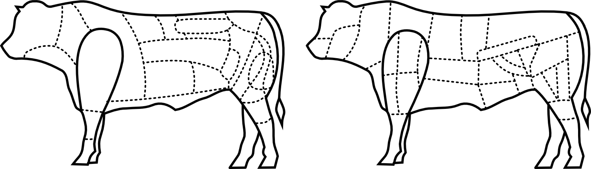

*Brazilian and French beef cuts*

The beauty of standards is that there are so many interpretations to choose from!

Because these standards are sometimes unclear, incomplete, or difficult to understand,
a variety of abuses are possible, even if the files are considered valid by individual parsers.

A *polyglot* is a file that has different types simultaneously,
which may bypass filters and avoid security counter-measures.
A *multiple-personality* (let's call them 'multi') file is one that is interpreted differently depending on the parser.
These files may look innocent (or corrupted) to one interpreter, malicious to another.
A *chimera* is a polyglot where the same data is interpreted as different types,
which is a more advanced kind of filter bypass.

A *collision* is a set of files that different files which contents gives the same result with a given (cryptographic) hash function.

This paper is a classification of various file techniques,
many of which have already been mentioned in previous PoCs and articles.
The purpose of this article is not to repeat all of the others,
but to collection them together for review and comparison.


# Identification

It's critical for any tool to identify the file type as early and reliably as possible.
The best way for that is to enforce a unique, not too short, fixed signature at the very beginning.
However, these magic byte signatures may not be perfectly understood, leading to some
possible problems.

Most file formats enforce a unique magic signature at offset zero.
It's typically - but not necessarily - four bytes.
Office documents begin with `DO CF 11 E0`,
ELF files begin with `7F .E .L .F`,
and Resource Interchange File Format (RIFF) files begin with `.R .I .F .F`.
Some magic byte sequences are shorter.

Because JPEG is the encoding scheme, not a file format,
these files are defined by the JPEG File Interchange Format or JFIF.
JFIF files begin with `FF D8`, which is one of the shortest magic byte sequences.
This sequence is often wrongly identified,
as it's typically followed by `FF E0` for standard header or `FF E1` for metadata in an EXIF segment.

BZip2's magic signature is only sixteen bits long, `B Z`.
However it is followed by the version, which is only supposed to be `h`,
which stands for Huffman coding.
So, in practice, BZ2 files always start with the three-byte sequence `.B .Z .h`.

A Flash video's magic sequence is three bytes long, `.F .L .V`.
It is followed by a version number, which is always `01`,
and a mask for audio or video.
Most video files will start with `.F .L .V 01 05`.

Some magic sequences are longer.
These typically add more characters to detect transfer errors,
such as FTP transfers in which ASCII-mode has been used instead of binary mode,
causing a translation between different end-of-line conventions, escaping, or null bytes.

Portable Network Graphic (PNG) files always use a magic that is eight
bytes long, `89 .P .N .G 0D 0A 1A 0A`.
The older (from version 4), traditional RAR file format begins with `.R .a .r .! 1A 07 00`,
while the newer RAR5 format is one byte longer, `.R .a .r .! 1A 07 01 00`.

Some magic signatures are obvious.
ELF (**E**xecutable & **L**inkable **F**ormat), RAR (**R**oshal **A**rchive),
and TAR (**T**ape **A**rchive) all use their initials as part of the magic byte sequence.

Others are obscure. GZIP uses `1F 8B`.
This is followed by the compression type, the only correct value for which is `08` for Deflate,
so all these files are starting with `1F 8B 08`.
This is derived from Compress, which began to use a magic of `1F 8D` in 1984,
but it's not clear why this was chosen.

Some are chosen for vanity.
Philipp Katz placed his initials in ZIP's magic value of `.P .K`,
while Fabrice Bellard chose `.F .B` for the BPG file format.
The DOS (and later LE/LX/NE/PE) executable header starts with `.M .Z` from Mark Zbikowski.
Terse Executables - the TE format is based on the PE format - start with `.V .Z` which comes from Vincent Zimmer.

Some use L33TSP34K sequences, such as `D0 CF 11 E0`, `CA FE BA BE`, and `CA FE FE ED`.
It looks cool, but there are only so many words that can be encoded as hex.
There aren't so many collisions,
but the most common one is of course `CA FE BA BE`,
which is used for Java .CLASS and Universal Mach-O.
These are easy to tell apart right after the magic, however.
In a Mach-O, the magic signature is followed by the number of architectures as a big-endian DWORD,
which means such a fat binary usually starts with `CA FE BA BE 00 00 00 02` to indicate support for x86 and PowerPC,
just two of the twenty supported architectures.
Conversely, a Java Class puts minor and major version numbers right after the magic,
and `major_version` should be greater than or equal to `2D`,
which indicated JDK 1.1 from [1997](http://docs.oracle.com/javase/specs/jvms/se7/html/jvms-4.html).

Some file formats can be seen as high-level containers,
with vastly differing internal file formats.
For example, the Resource Interchange
File Format (RIFF) covers the AVI video container,
the WAV audio container, and the animated image ANI.
Thus three different file types
(video, audio, animation) are relying on the same outer format,
which defines the magic that will be required at offset zero.

## Encodings

Some file formats accept different encodings, and each encoding uses a different Magic signature.

TIFF files can be either big or little endian,
with `.I .I` indicating Intel (little) endianness and `.M .M` for Motorola (big) endianness.
Right after the signature is the number forty-two encoded as a 16-bit word - `00 2A`
or `2A 00` depending on the endianness - so the different magics feel redundant!
A common `.T .I .F .F` magic before this endianness marker would have been good enough.

32-bit Mach-O files use `FE ED FA CE`, while 64-bit Mach-O files use `FE ED FA CF`.
The next two fields also imply the architecture,
so a 32-bit Mach-O for Intel typically starts with `FEEDFACE 00000007 00000003`,
while a 64-bit file starts with `FEEDFACF 01000007 80000003`,
defining a 64b magic, ABI64 architecture, and Lib64 as a subtype.

Flash's Small Web Format originally used the `.F .W .S` magic,
then its compressed version used the `.C .W .S` magic.
More recently, the LZMA-compressed version uses the `.Z .W .F` magic.
Once again, it doesn't make sense as the signatures are always followed by a version number.
A higher bit could have been set to define the compression if that was strictly necessary.
In practice, however, it turns out that there is rarely a check for these values.
Why do they bother defining a version number and file size if it just works with any value?

While most file formats enforce their magic at offset zero,
it's common for archive formats to NOT enforce magic at the start of an archive.
7ZIP, RAR, and ZIP have no such requirement.
However, some Unix compressors such as GZIP and BZip2 do demand proper magic at offset zero.
These are just designed to compress data,
with the filename being optional (for GZIP) or just absent (BZip2).

## Specific Examples

TAR, the Tape Archive format, was first used to store files via tape.
It's block-based, and for each file,
the header block starts with the filename.
The magic signature, depending on the exact version of TAR,
is present at offset 0x100 of the header block.
The whole header contains a checksum for itself, and this checksum is enforced.

PDF in theory should begin with a standard signature at offset zero,
`.% .P .D .F .- .1 ..`  `[0-7]`, but in practice this signature is required only to be within the first kilobyte.
This limit is odd, which is likely the reason why some PDF libraries don't object to a missing signature.
PDF is actually parsed bottom-up for a complete document interpretation to allow for incremental document modifications.
Further, the signature doesn't need to be complete!
It can be truncated, either to `%PDF-1.` or `%PDF\0`.

ZIP doesn't require magic at offset zero, and like PDF it's parsed from the bottom up.
In this case, it's not to allow for incremental updates;
rather, it's to limit those time-consuming floppy swaps when a multi-volume archive is created on the fly, on external storage.
The index structure must be located near the end of the file.

Even more confusingly,
it's common that viewers and the actual extractor will have a different threshold regarding the distance to the end of file.
WinRar, for example, might list the contents of an archive without error, but then silently fail to extract it!

Although standard ZIP tolerates not starting at offset zero or not finishing at the last offset,
some variants built on top of the ZIP format are pickier.
Keep this in mind when creating funky APK, EGG, JAR, DOCX, and ODT files.

## Bad Magic Signatures

OpenType fonts start with 00 01 00 00, which is actually not a magic signature,
but a version number, which is expected to be constant.
How pointless is that?

Windows icons (ICO) and static cursors (CUR) are using the same format.
This format has no official name, but it always has a magic of `00 00`.

Atom/box based formats (MP4, QT, JP2) don't start with any magic but directly with a standard chunk
often `.f .t .y .p` for MP4 format, but `.j .P 20 20` for JPEG2000 files.
As a consequence, most jp2 file start with `00 00 00 0C .j .P 20 20`.
But this lack of required magic makes it possible to start MP4 files directly with another kind of chunk such as `.f .r .e .e`  chunks which are just container.
It's therefore non-trivial to validate the type of such a files,and this makes it possible to precompute generic prefix pairs for MP4 hash collisions.

## Older revisions

Some formats tolerate older magic signature, such as `%!PS-Adobe-N.n PDF-M.m` for [PDF files](https://www.virustotal.com/gui/file/0442421086b7af9d09adc32706f7a53660d74baf350d5aa02acdc70815691460/detection),
which was recognized by Adobe Reader until version 6 in 2003.

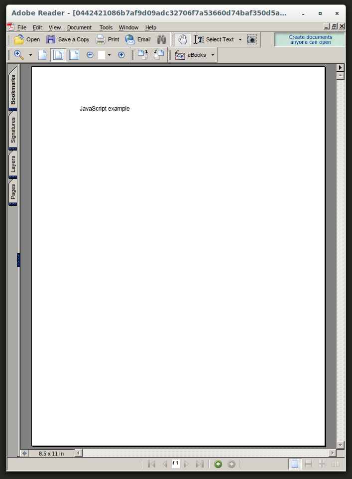

*Adobe Reader 6 opening a PDF with an old signature*

The [older format](https://www.virustotal.com/gui/file/cd786718428b5b49da6a7a8b70af86877213111e42af98a4b6475722c2735ba7/detection) of Rar 1.4 in 1993 has a different magic of `RE~^` is still supported by WinRar and [UnRar](https://github.com/adamhathcock/sharpcompress/blob/e13795651dceb14a40f2035eb54aebd629b2d57c/reference/unrar/archive.cpp#L102),
so despite its rarity and apparent obsolescence, it might actually be supported by modern software (while bypassing other security checks).

# Hardware Formats

Hardware-oriented formats typically have no header.
They are designed for efficiency, and their parser is implemented in hardware.
They are seen not as files, but as images burned into a ROM or similar storage.
They are directly read (and executed/interpreted) by a CPU,
which often specifies critical data at the very first offsets.

For example, floppy disks and hard disks begin with a 512-byte Master Boot Record (MBR) of executable code that must end with `0xAA55`.
Video game console ROMs often begin with the initial stack pointer and program counter.
The TGA image format, which was designed in 1984 as a raster image format to be read directly by a graphics board,
begins with the image's width and height.
(Version 2 of TGA has an optional footer, ending with a constant signature.)

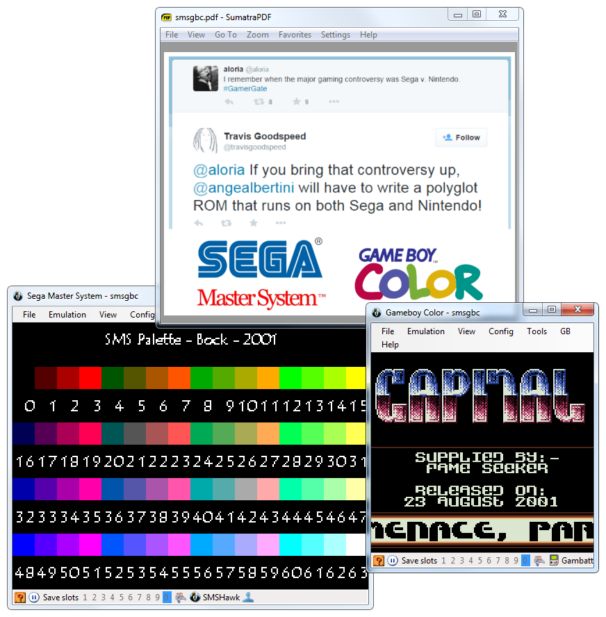

*Sega Master System, Gameboy Color & PDF Polyglot*

However, it's also common that some extra constant structure is required
at a specific offset, later in the memory space.
These requirements are often enforced in software by the BIOS or bootloader, rather than by a
hardware check. For example, a Megadrive (Genesis) cartridge must have
the ASCII string ["SEGA"](http://wiki.megadrive.org/index.php?title=TMSS) at offset 0x100.
A Gameboy ROM [must contain the Nintendo logo](http://problemkaputt.de/pandocs.htm\#thecartridgeheader) for its startup screen from offset 0x104 to 0x133,
one of the longest signatures required in any file format.

Super NES ROMs have a header later in the file, called the [Cartridge Header](http://problemkaputt.de/fullsnes.htm). The
exact offset of this header varies by the type of ROM, but it is always
far enough into the header that polyglot ROMs are easy to create.

## Abusing File Signature

Obviously, there is no room for abusing signatures as long as the content and the offset of the signatures are strictly enforced.
Signature abuse is possible when parsers are trying to recover broken files;
for example, some PDF readers don't require the presence of the PDF signature at all!

For example, here's a 62 bytes working PDF for FireFox.
Note that it doesn't have any signature, and doesn't even close angular brackets.
```
 1 0 obj<<>>endobj trailer<</Root<</Pages<</Kids[1 0R]/Count 1
```

Header abuse is also possible when the specification is incorrectly implemented.
For example, the GameBoy Pocket - and only the GameBoy Pocket - doesn't bother to fully check the BIOS signature.

## Blacklisting

As hinted previously, PDF can be easily abused.
For security reasons, Adobe Reader, the standard PDF reader,
has blacklisted known magic signatures such as PNG or PE since version 10.1.5.
It is thus not possible anymore to have a valid polyglot that would open in Adobe
Reader as PDF.
This is a good security measure even if it breaks compatibility with older releases of PoC||GTFO.

However, it's critical to blacklist the actual signature as opposed to what is commonly appearing in files.
JPEG File Interchange Format (JFIF) files typically start with the signature, SOI, and an APP0 segment,
which make the file start with `FF D8 FF E0`.
However, the signature itself is only `FF D8`,
which can lead to a blacklist bypass by using a different segment or different marker right after the signature.
I abused this trick to make a JPEG/PDF polyglot in [PoC||GTFO 3:3](https://github.com/angea/pocorgtfo#0x03),
but since then, Adobe has fixed their JFIF signature parsing.
As such, pocorgtfo03.pdf doesn't work in versions of Adobe Reader released since March of 2014.

Of course, blacklisting can only affect current existing formats that are already widespread.
The `.Z .W .S` signature that we used for `pocorgtfo05.pdf` is now blacklisted,
but the BPG signature used in `pocorgtfo07.pdf` is very recent so it has not been blacklisted yet.
Moreover, each signature to be blacklisted has to be added manually.
Requiring the PDF signature to appear earlier in the file - even just in the first 64 bytes instead of a whole kilobyte - would proactively prevent a lot of polyglot types,
as most recent formats are dense at the start of the file.
Checking the whole signature would also make it even harder,
though not respecting your own standard even for checking signatures is an insult to every standard.


# File Format Structures

Most file formats are either chunk-based or pointer-based.
Chunked files are often some variant of Tag/Length/Value (TLV),
which are versatile and size-efficient.
Pointer-based files are better adapted to direct memory mapping.
Let's have some fun with each.

## Chunk Sequences

The information is cut into chunks, which all have the same top-level structure,
often defining a type, via a tag, then the length of the chunk data to come,
then the chunk content itself, of the given length.
Some formats such as PNG also require their chunks to end with a checksum,
covering the rest of the chunk.
(In practice, this checksum isn't always enforced.)

For even more space efficiency, BZip2 is chunk based,
but at the bit level! Bytes are never padded, and structures are not aligned.
It doesn't waste a single bit, but for that reason it's damned near unreadable with a standard hex viewer.
Because no block length is pre-encoded,
block markers are fairly big, taking 48 bits.
These six bytes, if they were aligned, would be `31 41 59 26 53 59`, the BCD representation of π.

## Structure Pointers

The first structure containing the magic signature points to the other structures,
which typically don't lie immediately after each other.
Pointers can be absolute as in file offsets,
or relative to the current structure's offset or to some virtual address.
In many cases, relative pointers are unsigned.
Typically, executable images use such pointers for their interrupt tables or entry points.

In many chunk-based formats such as FLV,
you can inflate the declared size of a chunk without any warnings or errors.
In that case, the size technically behaves as a relative pointer to the next chunk, with a lower limit.


*Sega Megadrive, Super Nintendo & PDF Polyglot*


# Abusing File Format Structures

## Empty Space

Block-sized formats, such as [ISO](https://github.com/angea/pocorgtfo#0x05), [TAR](https://github.com/angea/pocorgtfo#0x06),
and ROM dumps often contain a lot of extra space that can be directly abused.

In theory, it may look like TAR should have lots of zero bytes,
but in practice, it's perfectly fine to have one that's 7-bit ASCII!
This makes it possible to produce an ASCII abstract that is a valid TAR.
For good measure, this is not only an ASCII TAR, but also a PDF.
The ASCII art comes free.

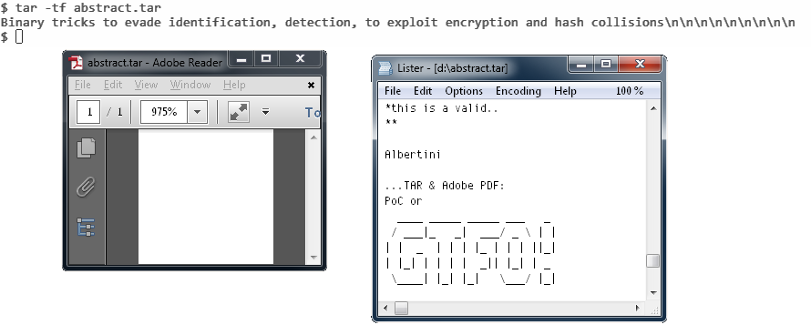

*PDF, TAR Polyglot in 7-bit Clean ASCII*

## Appended Data

Since many formats define an end marker, adding any data after is usually tolerated:
after all, the file is complete, parsing can end successfully.
However, it's also easy for them to check if they reached the end of the file;
in this case (such as BPG or Java Class), no appended data is tolerated at all.

## Trailing Space

Metadata fields are often null-terminated with a maximum length.
This gives us a bit of controllable space after the null character.
That way, one could fit a PDF signature and stream declaration within the metadata fields of a NES Sound Format (NSF) to get a working polyglot.

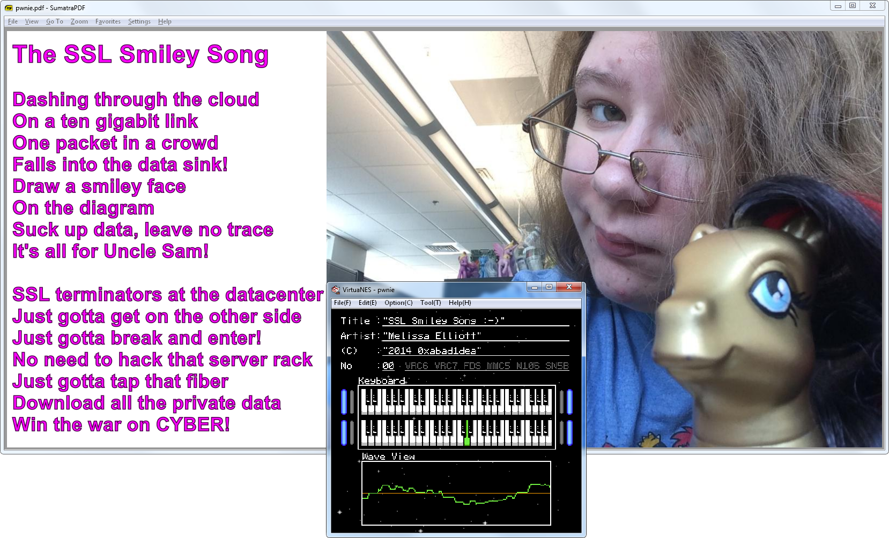

*PDF and NES Sound Format polyglot*

This is shown here, where the NSF's Title is `SSL Smiley song :-)\\0%PDF-1.5`.
Similarly, the Author is `Melissa Eliott\0 9 0 obj $<<<>>$%` and the Copyright is `2014 0xabad1dea"0 \n stream \n`.

The original metadata is preserved, while declaring a PDF file and a dummy PDF object that will cover the rest of the data of the NSF file.

## Infinite recursion

Including itself to trigger infinite recursion is another way to make a parser stop parsing.
It was used in [PoC||GTFO 0x17](https://github.com/angea/pocorgtfo#0x17) to force the AGC assembler to ignore appended data after the source.

## Non-Critical Space

Some fields are required by a standard,
but the parsers will forgive us for violations of the standard.
These parsers try to recover information out of corrupt files rather than halting on invalid structures.

JFIF is a clear example.
Many JFIF segments clearly define their length,
however nothing prevents you from inserting extra data at the end of one segment.
This data may be ignored, and the parser will just look for the next segment marker.
Since JFIF specifies that all segments are made of `FF` followed by a non-null byte,
as long as your extra data doesn't encode a segment marker for a known segment type, you're fine.
Known types include **D**efine **Q**uantization **T**able `FF DB`,
**D**efine **H**uffman **T**able `FF C4`, **S**tart **O**f **S**can `FF DA`,
and **E**nd **O**f **I**mage `FF D9`.

In console ROMs, CPU memory space often starts with interrupt vector tables.
You can adjust the handler addresses to encode a useful value,
or sometimes use arbitrary values for unused handlers.

## Making Empty Space

In a chunk-structured format, you can often add an auxiliary chunk to carve extra space.
Forward compatibility makes readers fully ignore the extra chunk.

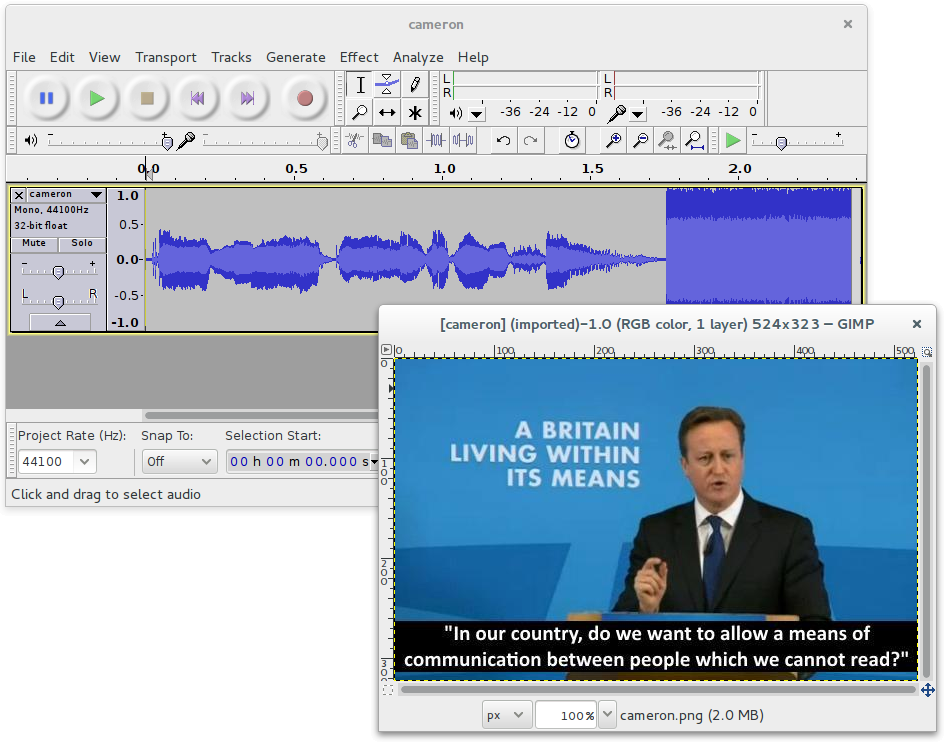

*PNG whose "duMb" chunk contains PCM Audio*

Sometimes, you have to flip a bit to enable structure space that can be abused.
Examples include the 512-byte training buffer in the iNES (.nes) ROM format,
which is used to hold code for enabling cheats.

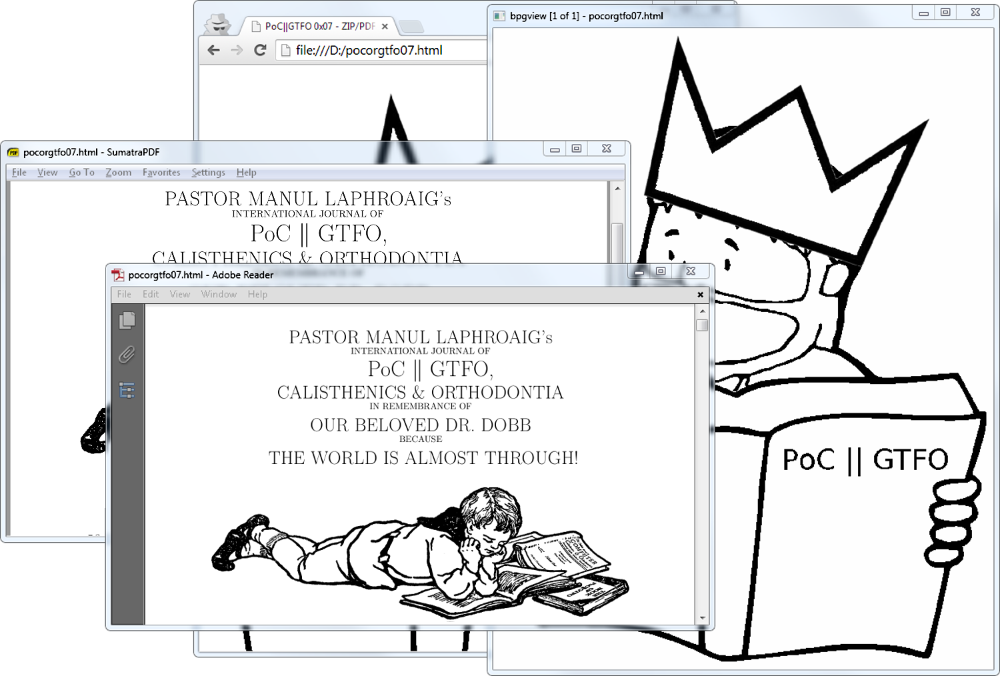

*BPG/HTML/PDF Polyglot. ZIP not shown*

Some formats like Atom/Box make it possible to use 2 encodings for chunk lengths: as 32b and 64b.
The default Length/Type/Value chunk uses a 32-bit length.
To use a 64-bit length, a bogus 32-bit length of 1 must be used.
The actual length as 64-bit is then stored after the Type, before the value,
which then turns the chunk into `marker/Type/Length/Value`.
It turns out that Length stored that way are usually not enforced to be bigger than 32-bits,
which gives you the control to use length as either before or after the type,
which maybe very useful for some hash collisions:
for example the Shattered collision only works reliably with T/L/V structures.

### A PDF/ZIP/BPG/HTML polyglot

[BPG](http://bellard.org/bpg/) stands for Better Portable Graphics.
It was recently created as an alternative to JPG, PNG, and GIF.
BPG images can be lossy or lossless.
The format supports animation and transparency.

To give BPG more exposure, this issue is a PDF/ZIP/BPG/HTML polyglot.
Also, we're running out of formats that Adobe hasn't blacklisted as polyglots.

BPG's structure is very compact.
Some fields' bits are split over different bytes, most numerical values are variable-length encoded,
and every attempt is made to avoid wasted space.
Besides the initial signature, everything is numerical.
"Chunk types" - also called "extension tags" - are not ASCII like they commonly are in PNG.
Information is byte-aligned, so the format isn't quite so greedily compressed as BZip2.

BPG enforces its signature at offset zero, and it is not tolerant to appended data,
so the PDF part must be inside of the BPG part.
To make a BPG polyglot, enable use the extension flag to add your own extension with any value other than 5,
which is reserved for the animation extension.
Now you have a free buffer of an arbitrary length.

Since the author of BPG helpfully provides a standalone JavaScript example to decompress and display this format,
a small page with this script was also integrated in the file.
That way the file is a valid BPG, a valid PDF, and a valid HTML page that will display the BPG image.
You just need to rename pocorgtfo07.pdf to pocorgtfo07.html.
You can see this in [bpghtmlpdf](bpghtmlpdf).

Thanks to Mathieu Henri for his help with the HTML part.

### Moving Structures Around

In a pointer-chained format, you can often move structures around or even inside other structures without breaking the file.
These parsers never check that a structure is actually after or outside another structure.

Technically-speaking, an FLV header defines its own size as a 32-bit word at offset 0x05, big endian.
However nothing prevents you from making this size bigger than used by Flash.
You can then insert your data between the end of the real header and the beginning of the first header packet.

To make some extra space early in ROMs, where the code's entrypoint is always at a fixed address,
just jump over your inserted data.
Since the jump instruction's range may be very limited on old systems, you may need to chain them to make enough controllable space.

## Structure Order

To manipulate encryption/decryption via initialization vector,
one can control the first block of the file to be processed by a block cipher,
so the content of the file in this first block might be critical.
It's important then to be able to control the chunk order,
which may be against the specs, and against the abilities of standard processing libraries.
This was used as AngeCryption in [PoC||GTFO 3:11](https://github.com/angea/pocorgtfo#0x03).

The minimal chunk requirements for PNG are IHDR, IDAT, and IEND.
PNG specifies that the IHDR chunk has to be first,
but even though all image generators follow this part of the standard,
most parsers fail to enforce the requirement.

The same is true for JFIF (JPEG) files.
The APP0 segment should be first, and it is always generated in this position,
but readers don't really require it.
In practice, a JFIF file with no APPx segments often produces neither warnings nor errors.
This shows a functional JPEG that has no APPx segments, neither a JFIF signature nor any EXIF metadata!

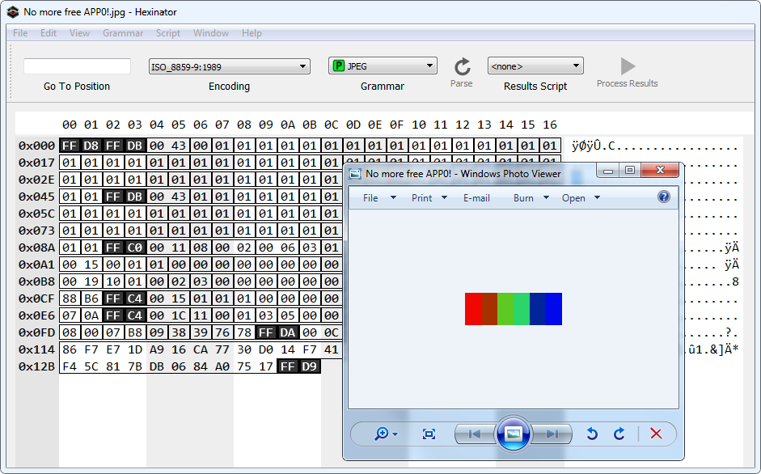

*JPEG with no APPx segments*


# Data Encodings

It's common for different file formats to rely on the same data encodings that have been proved reliable and efficient,
such as JPEG for lossy pictures or Deflate/Zlib.
Thus it's possible to make two different file formats in the same file relying on the same data, stored with the same encoding.

<!--
Offset |Content|JPEG|PDF|ZIP
`00000`|`FF D8`|magic
`00002`|`FF E0 00 10 .J .F .I .F ...`|header
`00014`|`FF FE 02 1F`|comment segment start
`00018`|`%PDF-1.4`||PDF header & document
`...`  |
`00140`|`20 0 obj`| | dummy object start
`...`  |`<</length ...`
`...`  |`stream`
`00168`|`.P .K 03 04`|||local file header start
`00181`|`00 9B`|||filename length
`00186`|`endstream`|||lfh's filename
`...`  |`endobj`||dummy object end|(abused)
`...`  |
`...`  |`5 0 obj`||image object start
`...`  |`<</Width 400 ...`
`...`  |`stream`|
`00221`|`FF D8 FF E0 ...`||image header|stored file data
`...`  |`48 00 48 00 00`| (end of comment)
`00235`|`FF DB 00 43 ...`|image data (DQT)|-|-
`112B5`|`FF D9`| end of image|-|-
`112B7`|`FF FE 00 E6`|segment comment start
`112BC`|`endstream`||end of image object
`...`  |`endobj`
`...`  |
`...`  |`24 0 obj`||dummy object start
`...`  |`stream`|
`112DE`|`.P .K 01 00`|||central directory
`1130C`|corkami.jpg|||filename (correct)
`11317`|`.P .K 05 06`|||end of central directory
`1132B`|`75 00`|||length of comment
`1132E`|`endstream`||end of dummy object|archive comment
`...`  |`endobj`
`...`  |
`...`  |`xref`||xref, trailer
`...`  |...|
`1139A`|`%%EOF`||end of file
`...`  |`%`||line comment
`113A1`|`FF D9`|end of image marker
`...`  |||(end of line)|(end of comment)
-->

Offset  | Content                       | JPEG                  | PDF                   | ZIP
------- | ----------------------------- | --------------------- | --------------------- | ------------------------
`00000` | `FF D8`                       | magic                 |                       |
`00002` | `FF E0 00 10 .J .F .I .F ...` | header                |                       |
`00014` | `FF FE 02 1F`                 | comment segment start |                       |
`00018` | `%PDF-1.4`                    |                       | PDF header & document |
`...`   |                               |                       |                       |
`00140` | `20 0 obj`                    |                       | dummy object start    |
`...`   | `<</length ...`               |                       |                       |
`...`   | `stream`                      |                       |                       |
`00168` | `.P .K 03 04`                 |                       |                       | local file header start
`00181` | `00 9B`                       |                       |                       | filename length
`00186` | `endstream`                   |                       |                       | lfh's filename
`...`   | `endobj`                      |                       | dummy object end      | (abused)
`...`   |                               |                       |                       |
`...`   | `5 0 obj`                     |                       | image object start    |
`...`   | `<</Width 400 ...`            |                       |                       |
`...`   | `stream`                      |                       |                       |
`00221` | `FF D8 FF E0 ...`             |                       | image header          | stored file data
`...`   | `48 00 48 00 00`              | (end of comment)      |                       |
`00235` | `FF DB 00 43 ...`             | image data (DQT)      | -                     | -
`112B5` | `FF D9`                       | end of image          | -                     | -
`112B7` | `FF FE 00 E6`                 | segment comment start |                       |
`112BC` | `endstream`                   |                       | end of image object   |
`...`   | `endobj`                      |                       |                       |
`...`   |                               |                       |                       |
`...`   | `24 0 obj`                    |                       | dummy object start    |
`...`   | `stream`                      |                       |                       |
`112DE` | `.P .K 01 00`                 |                       |                       | central directory
`1130C` | corkami.jpg                   |                       |                       | filename (correct)
`11317` | `.P .K 05 06`                 |                       |                       | end of central directory
`1132B` | `75 00`                       |                       |                       | length of comment
`1132E` | `endstream`                   |                       | end of dummy object   | archive comment
`...`   | `endobj`                      |                       |                       |
`...`   |                               |                       |                       |
`...`   | `xref`                        |                       | xref, trailer         |
`...`   | ...                           |                       |                       |
`1139A` | `%%EOF`                       |                       | end of file           |
`...`   | `%`                           |                       | line comment          |
`113A1` | `FF D9`                       | end of image marker   |                       |
`...`   |                               |                       | (end of line)         | (end of comment)

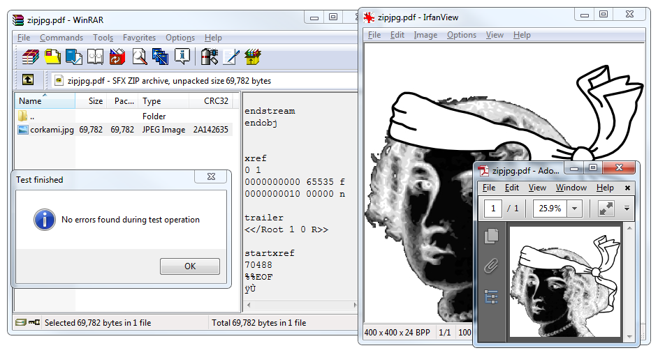

## Abusing Data

### JPG/PDF/ZIP Chimera

For this kind of abuse,
it's important to see if what comes directly before the data can be abused,
and how the data offset can be abused.

A PDF directly stores JPG image and so does a ZIP archive using no compression,
except that a ZIP's Local File Header contains a duplicate of the filename just before the file data itself.

Thus, we can create a single chimera that is at once a ZIP, a JPG, and a PDF.
The ZIP has the JPEG image as a JFIF file, whereas the whole file is also a valid JPEG image,
and the whole file is also a PDF that displays the image!
Even better, we only have one copy of the image data;
this copy is reused by each of the forms of the chimera.

There are two separate JFIF headers.
One is at the top of the file so that the JFIF file is valid,
and a duplicate copy is further in the file, right before the JPEG data, after the PDF header and the ZIP's Local File Header.

Other kinds of chimeras are possible.
For example, it's not hard to use TAR instead of ZIP as the outer archive format.
A neighbor could also use PNG (Zlib-compressed data, like in ZIP) instead of JPG.

One beautifully crafted example is the [Image puzzle](http://web.mit.edu/puzzle/www/2015/puzzle/image/) proposed at the MIT Mystery Hunt 2015.
It's a TIFF and an EXT2 filesystem where all the EXT2 metadata is visible in the TIFF data,
and the filesystem itself is a maze of recursive sub-directories and TIFF tiles.

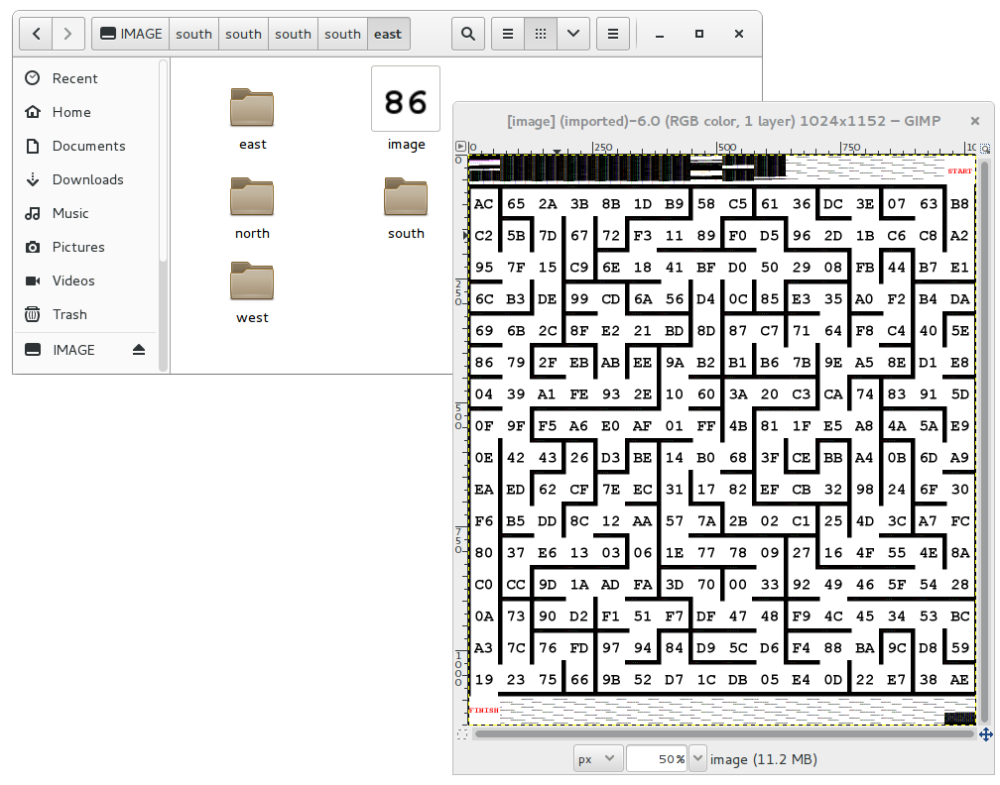

*TIFF/EXT2 Chimera*

## Abusing Data to Contain an Extra Kind of Information

Typically, RGB pixels of images don't need to follow any particular rule.
Thus it's easy to hide various kinds of data as fake image values.

This also works in PDF objects, where lossy compression such as JBIG2, CCITT Fax,
and JPEG2000 can be used to embed malicious scripts.
These are picture formats, but nothing prevents us from hiding other types of information in them.
PDF doesn't enforce these encodings to be specifically used on objects referenced as images,
but allows them on any object, even JavaScript ones.

Moreover, image dimensions and depth are typically defined in the header,
which tells in advance how much pixel data is required,
and appending any extra data *within* the pixel stream - such as in the IDAT chunk of a PNG,
which is Zlib-wrapped-will not trigger any problem with viewers.
All the original pixels are present, so the image is perfect,
and the extra appended data in the pixel stream remains.
This can be used to hide data in a PNG picture without any obvious appended data after the IEND chunk.

## Abusing Image Parsing

In some specific cases, such as barcodes, images are parsed after rendering.
Even in extreme cases of barcode manipulation, it's still quite easy to see that they could be parsed as barcodes.

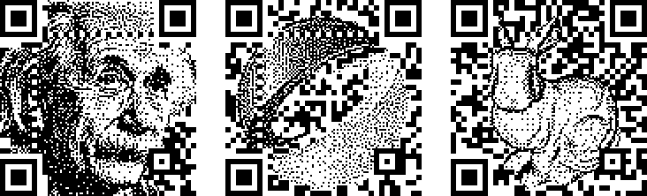

*Artistic, Valid QR Codes*

These examples come from a [SIGGRAPH Asia 2013 paper](http://vecg.cs.ucl.ac.uk/Projects/SmartGeometry/halftone\_QR/halftoneQR\_sigga13.html) by fine folks at the City College of London on Half-Tone QR Codes.

However, we usually have no control over the scanning software.
This software determines which types of barcodes will be scanned,
and in which order they will be parsed.
By relying on error code information recovery - and putting a different kind of barcode inside another one!
- QR Inception is not only possible, but was thoroughly investigated by the fine folks at SBA Research in Vienna!
(`unzip pocorgtfo07.pdf abusing_file_formats/qrinception.pdf` by Dabrowski et al).

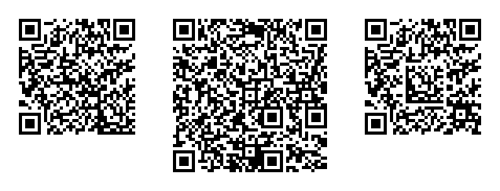

*Barcode-in-Barcode Inceptions*

## Corrupting Data to Prevent Standard Extraction

Although many parsers may refuse to extract a corrupted stream,
it's possible that some will parse until corruption is found and attempt to use the undamaged portion.
By appending garbage data and corrupting its encoding,
we can create a stream that still contains its information,
but will not be extracted by purist tools!

Appending garbage, compressing, then truncating the last compressed block is a straightforward way to do this with Zlib and Deflate.
Using LZMA without End of Stream markers also works.
As mentioned before, you also get the same result by corrupting the CRC32 of a JAR.
Most if not all ZIP extractors will fail to open the archive,
whereas Java itself will ignore and execute the classes just fine.

In a similar but a bit more unpredictable way,
it looks like most Windows viewers open a PNG file with corrupted checksums in critical chunks just fine.
Most Linux viewers reject the file completely.

## Abusing Encoding to Bypass Filter


### ASCII Zlib Stream

As Gábor Molnár proved with ASCII Zip (`git clone https://github.com/molnarg/ascii-zip`),
it's possible to turn the Huffman coding used in Zlib into an ASCII-only expansion,
and thus send a Zlib-compressed binary as a standard ASCII string.
An ASCII gzip file using this trick is shown here:

```
$ cat asciizip
xÚD0Up0IZUnnnnnnnnnnnnnnnnnnnUU5nnnnnn3SUUnUUUwCiudIbEAt33wwWt3ww0GDDGtwwDDwDt03GGpDD33333s03333GDdFPWOsookwKgQ1↨$♥l
$ printf "\x1f\x8b\x08\0\0\0\0\0" | cat - asciizip | gzip -dc
PoC||GTFO !
```
<!--
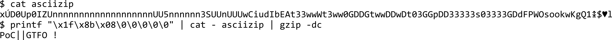

*ASCII Zlib Stream*
-->

Michele Spagnuolo used this same trick in the better known Rosetta Flash attack,
the details of which you can find described in [PoC||GTFO 5:11](https://github.com/angea/pocorgtfo#0x05).

### Lossless JPEG

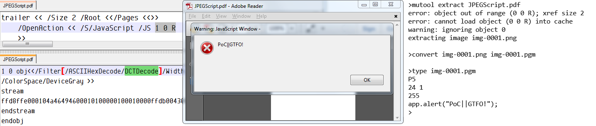

*JPEG-Encoded JavaScript*

We can abuse JPEG's lossy compression and turn it lossless.
Since it's lossy by definition, it makes sense to expect that it cannot be controlled,
so it is often ignored by security software.
But, by encoding a greyscale JPEG, chrominance and luminance separation is fully predictable,
as there is no more chrominance.
Combining this with either 100% quality compression or a specific quantization matrix allows the decompressed data to be predictable and reusable! Dénes Óvári demonstrated PoC of this in VirusBulletin 2015/03,
(`unzip pocorgtfo07.pdf abusing\_file\_formats/vb201503-lossy.pdf`) and an example of the technique is shown in [jpegscript](jpegscript).

## Altering Data to Contain Extra Information

### Image and Sound

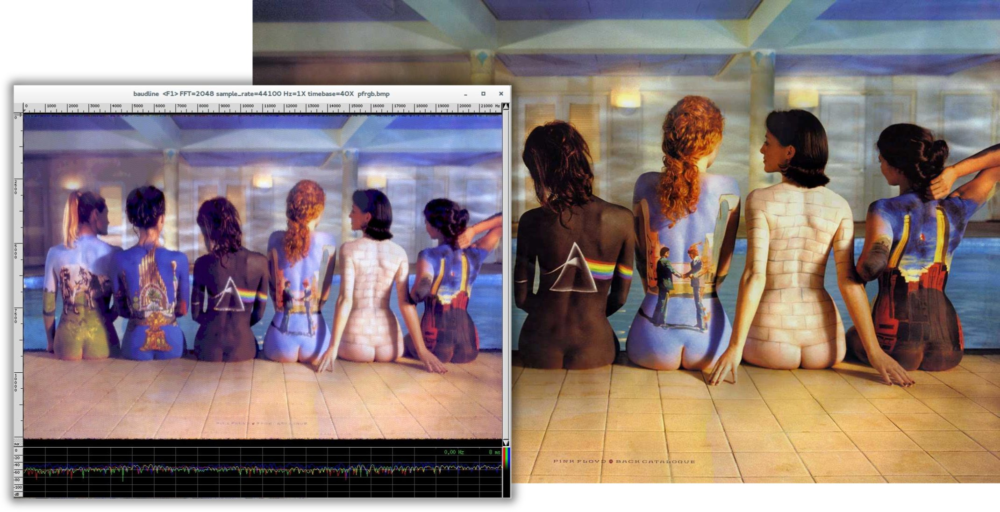

*BMP Image with Another Image as RGB Channels in PCM Audio*

When sound is stored as 32-bit PCM,
the 16 lower bits can be modified without much effect on the final sound as 16-bit resolution allows for a comfortable dynamic range of about 96 dB.

The BMP file format allows us to define *both* which color channels are stored *and* on how many bits those channels are stored.
Thus, it's possible to store a 16-bit picture as 32-bit words,
leaving 16 bits of each word unused!
By combining these two techniques, we can mix picture and sound on the same words:
16 bits of audible sound, 16 bits of visible pixel colors.
The sound is ignored for the picture, and the image drops below the threshold of hearing.

And if you're cheeky, you can encode another picture in sound, that will be visible via spectrogram view.
Or encode some actual sound, with a banner picture encoded in the higher frequencies;
this way, the sound is still worth listening to yet also a thin picture is visible in the [spectrogram view](http://wiki.yobi.be/wiki/BMP_PCM_polyglot).

### Sound and Sound

Not only can you combine a BMP and PCM together,
you can also encode two [different sound signals](http://wiki.yobi.be/wiki/WAV\_and\_soft-boiled\_eggs) together by using different endianness and allowing the unchosen signal to drop beneath the noise floor.

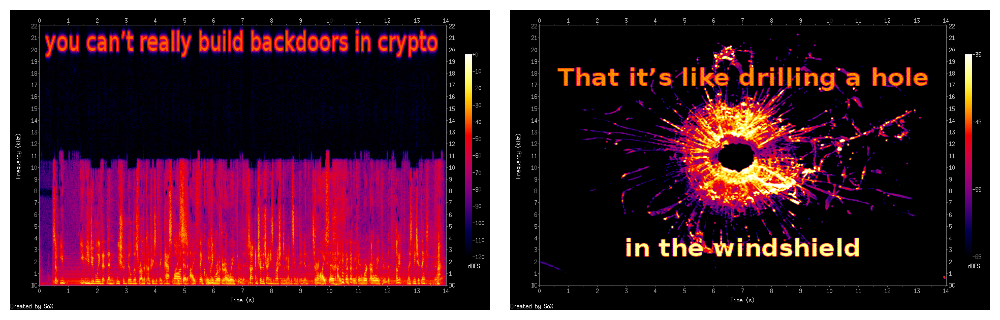

*Two Sound Files Combined, with Spectral Images*

This demonstrates a single file whose spectrogram is one image as big endian and a different image as little endian.
Note that the text in the left interpretation is in inaudibly high frequencies,
so it can peacefully coexist with music or speech in the lower frequencies.

### Two Kinds of multi PNGs

In a similar way, by altering the Red/Green/Blue channels of each pixel,
one gets a similar image but with extra information.

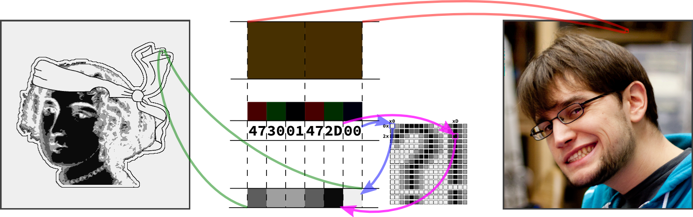

In naive steganography, this is often used to encode external data on
the least significant bits, but we can also use this to encode one image
within another image and create a multi picture!

Paletted image formats typically don't require that each color in the palette be unique.
By duplicating the same sixteen colors over a 256-color palette, one can show the same image,
but with extra information stored by whatever copy of the palette index is used.
(Original idea by Dominique Bongard, re-implemented with Philippe Teuwen.)

By combining both the redundant palette trick and the altered RGB components trick,
we can [store two images](http://wiki.yobi.be/wiki/PNG\_Merge).
One image appears when the palette is taken into account,
and the other appears when the palette is ignored, and the raw RGB displayed.
Note that although an RGB picture with an extra palette isn't necessarily against the specs,
there doesn't seem to be any legitimate example in the wild.
(Perhaps this could be used to suggest which color to use to render on limited hardware?)
As a bonus, the palette can contain itself a third image.

A related technique involves storing two 16-color pictures in the same data by illegally including two palettes.
A PNG file having two palettes is *against* the specifications, but many viewers tolerate it.
Some parsers take the first palette into account, and some the last,
which leads to two different pictures from the same pixel information.

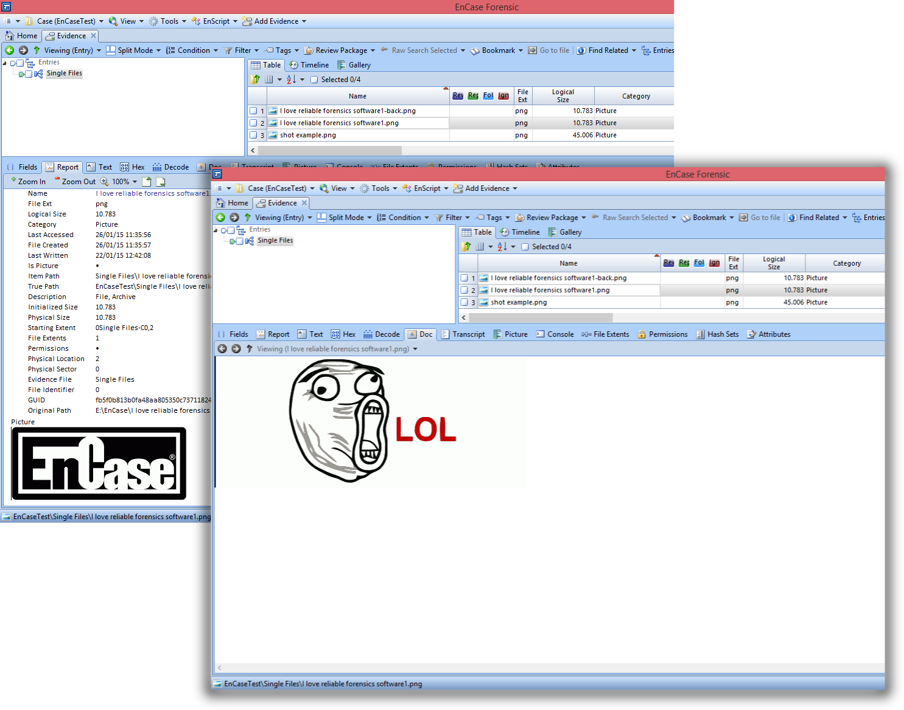

*Multi PNG via Double Palettes, in Encase Forensic v7*

Unfortunately, most readers just reject the file. (Screenshot by Thijs Bosschert.)


# Multiple personality

## Semi-Constance

### Constant Obstacles Make People Take Shortcuts.

If most implementations use the same default value,
then some developer might just use this value directly hardcoded.
If a majority of developers do the same,
then the variable aspect of the value would break compatibility too often,
forcing the value to be constant, equal to its default.
Already in DOS time, the keyboard buffer [was supposed](http://stanislavs.org/helppc/bios_data_area.html) to be variable-sized.
It had a default start and size (`40:1E`, and 32 bytes),
but you were supposed to be able to set a different head and tail via `40:1A` and `40:1C`.
However, most people just hardcoded `40:1E`,
so the parameters for head and tail became not usable.

### BMP Data Pointer

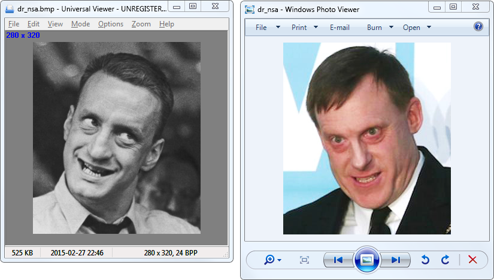

*Multi BMP with Non-Default Data Pointer*

A BMP's header contains a pointer to image data.
However, most of the time, the image data strictly follows the headers and starts at offset `0x36`. Consequently, some viewers just ignore that pointer and just incorrectly display the data at offset 0x36 without paying attention to the header length.

So, if you put two sets of data, one at the usual place, and one farther in the file, pointed at from the header, two readers may give different results. This trick comes from Gynvael Coldwind.

## Unbalanced Nested Markers

It's a well known fact that Web browsers don't enforce HTML markers correctly.
A file containing only `a<b>c` will show a bold "c" despite the lack of `<html>` and `<body>` tags.

In file formats with nested markers, ending these markers earlier than expected can have strange and lovely consequences.

For example, PDF files are made of objects.
An object is required to end with `endobj`.
Some of these objects contain a stream, which is required to end with `endstream`.
As the stream is contained within the object,
`endstream` is expected to always come first, and then `endobj`.

In theory, a stream can contain the keyword endobj,
and that should not affect anything.
However, in case some PDF generators should forget to close the stream before the object,
it makes sense for a parser to close the object even if the stream hasn't been closed yet.
Since this behavior is optional, different readers implement it in different ways.

This can be abused by creating a document that contains an object with a premature `endobj`.
This sometimes confuses the parser by cloaking an extra root element different from the one defined in the trailer, as illustrated here:

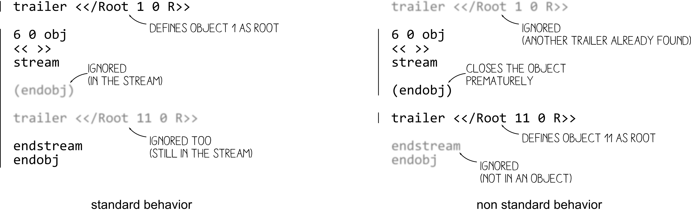

*One PDF, Two Interpretations*

Such a file will be displayed as a totally different document, depending upon the reader.

Here is such a multi PDF:

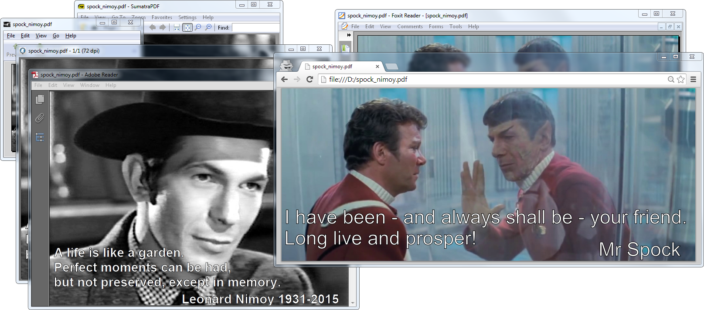

*Multi PDF by Closed String Object (endobj)*


# Icing on the Cake

After modifying a file, there are checksums and other limitations that must be observed.
As with any other rule, there are exceptions, which we'll cover.

## ZIP CRC32

Most extractors enforce a ZIP file's checksums,
but for some reason Java does not when reading JAR files.
By corrupting the checksums of files within a JAR,
you can make that JAR difficult to extract by standard ZIP tools.

## PNG CRC32

PNG also contains CRC32 checksums of its data.
Although some viewers for Unix demand correct checksums,
they are nearly never required on Windows. No warnings, no nothin'.

## TAR Checksum

Tar checksums aren't complicated, but the algorithm is so old-timey that it warms the heart just a little.

## Truecrypt Header

A Truecrypt disk's header is encrypted according to the chosen algorithm, password, and keyfile. Prior to the header, the disk begins with a random 64-byte salt, allowing for easy manipulation of headers.
See my article on Truecrypt, [PoC||GTFO 4:11](https://github.com/angea/pocorgtfo#0x04), for a PDF/ZIP/Truecrypt polyglot.


# Size Limitation

It's common that ROM and disk images require a specific rounded size,
and there is often no workaround to this.
You can merge a PDF and an Apple II floppy image,
but only if the PDF fits in the 143,360 byte disk image.

If you need a bigger size, you can try with hard disk images for the same system, if they exist.
In this case, you can put them on a two megabyte hard disk image, with partitioning as required. Thanks to Peter Ferrie for his help with this technique,
which was used to produce this polyglot:
an Apple II disk image of Prince of Persia that doubles as a PDF.


*Apple II & PDF Polyglot*


# Challenges

## Limitations of Standard Libraries

Because most libraries don't give you full control over the file structure,
abusing file formats is not always easy.

You may want to open the file and just modify one chunk,
but the library - too smart for its britches - removed your dummy chunk,
recompressed your intentionally uncompressed data, optimized the colors of your palette,
and ruined other carefully chosen options.
In the end, such unconventional proofs of concept are often easier to generate with a small script made from scratch rather than relying on a well-known bulletproof library.

## Normalization

To make your scripts more efficient,
it might be worth finding a good normalizer program for the filetype you're abusing.
There are lots of good programs and libraries that will not modify your file in depth,
but produce a relatively predictable structure.

For PDF, running mutool clean is a good way to sand off any rough edges in your polyglot.
It modifies very little, yet rebuilds the XREF table and adjusts objects lengths,
which turns your hand-made tolerated PDF into one that looks perfectly standard.

For PNG, `advpng -z -0` is a good way to produce an uncompressed image with no line filters.

For ZIP, TorrentZip is a good way to consistently produce the exact same archive file.
AdvDef is a good way to (de)compress Zlib chunks without altering the rest of the file in any way.
For example, when used on PNGs, no PNG structure is analyzed, and just the IDAT chunks are
processed.

Normalizing the content data's range is sometimes useful, too.
A sound or image that consumes its entire dynamic range leaves more room for hidden data in the lower bits.

## Compatibility

If your focus is still on getting decent compatibility,
you may pull your hair a lot.
The problem is not just the limit between valid and invalid files;
rather, it's the difference between the parser thinking "Hey this is good enough." and "Hey, this looks corrupted so let's try to recover what I can."

This leads to bugs that are infuriatingly difficult to solve.
For example, a single font in a PDF might become corrupted.
One image - and only one image! - might go missing.
A seemingly trivial polyglot then becomes a race against heisenbugs,
where it can be very difficult to get a good compatibility rate.

## Automated Generation

Although it's possible to alter a generated file,
it might be handy to make a file generator directly integrate foreign data.
This way, the foreign data will be integrated reproducibly,
whereas the rest of the structure is already one hundred percent standard.

### Archives

Archiving a file without any compression usually stores it as is.
Please note, however, that some archive formats will escape data in order to prevent stored data from interfering with the outer format.

### PDFLaTeX

PDFLaTeX has special commands to create an uncompressed stream object,
directly from an external file.
This is extremely useful, and totally reliable,
no matter the size of the file.
This way, you can easily embed any data in your PDF.

``` {.latex language="TeX"}
\begingroup
  \pdfcompresslevel=0\relax
    \immediate\pdfobj stream
        file {foo.bin}
\endgroup
```

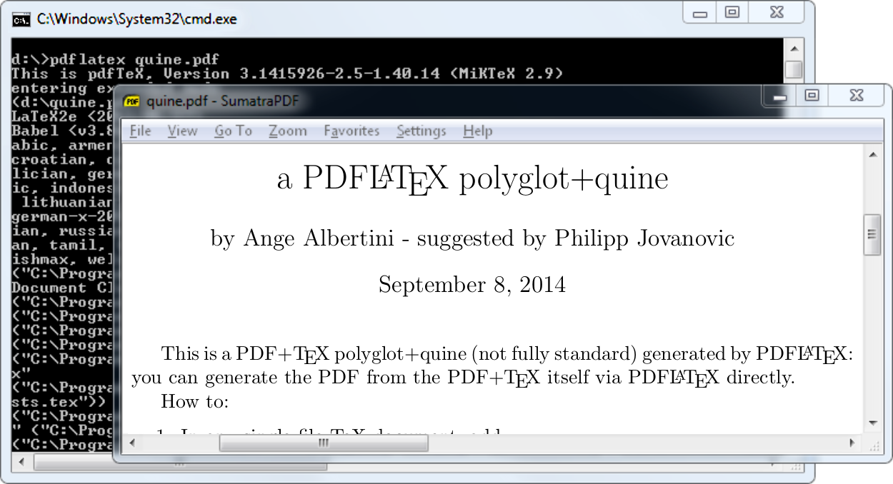

*a PDFLaTeX/PDF quine*

### A PDFLaTeX/PDF Polyglot

If your document's source is a single .tex file,
then you can make a PDFLaTeX quine.
This file is simultaneously its own TeX source code and the resulting PDF from compilation.
If your document is made of multiple files,
then you can archive those files to bundle them in the PDF.

You can also do it the other way around.
For his [Zeronights 2014 keynote](http://www.openwall.com/presentations/ZeroNights2014-Is-Infosec-A-Game/), *Is infosec a game?*,
Solar Designer created an actual point and click adventure to walk through the presentation.

It would be a shame if such a masterpiece were lost,
so he made his own walkthrough as screenshots,
put together as a slideshow in a PDF,
in which the ZIP containing the game is attached.
This way, it's preserved as a single file,
containing an easy preview of the talk itself and the original presentation material.

### Embedding a ZIP in a PDF

However, if you embed a ZIP in a PDF as a simple PDF object,
it's possible that the ZIP footer will be too far from the end of the file.
Objects are stored before the Cross Reference table,
which typically grows linearly with the number of objects in the PDF.
When this happens, ZIP tools might fail to see the ZIP.

A good way to embed a ZIP in a PDF,
as Julia Wolf showed us with napkins in [PoC||GTFO 1:05](https://github.com/angea/pocorgtfo#0x01),
is to create a fake stream object *after* the xref,
where the trailer object is present, before the startxref pointer.
The official specifications don't specify that no extra object should be present.
Since the trailer object itself is just a dictionary,
it uses mostly the same syntax as any other PDF objects,
and all parsers tolerate an extra object present within this area.

1.  PDF Signature
2.  PDF Objects
3.  Cross Reference Table
4.  *(extra stream object declaration)*
    -   ZIP Archive
5.  Trailer Object
6.  startxref Pointer

This gives a fully compatible PDF, with no need for pointer or length adjustment.
It's also a straightforward way for academics to bundle source code and PoCs.

### Appended Data

If for some reason you need the ZIP at the exact bottom of the file,
such as to maintain compatibility with Python's EGG format,
then you can extend the ZIP footer's comment to cover the last bytes of the PDF.
This footer, called the End of Central Directory,
starts with `.P .K 05 06` and ends with a variable length comment.
The length is at offset 20, then the comment itself starts at offset 22.

If the ZIP is too far from the bottom of the file,
then this operation is not possible as the comment would be longer than 65536 bytes.
Instead, to increase compatibility, one can duplicate the End of Central Directory.
I describe this trick in [PoC||GTFO 4:11](https://github.com/angea/pocorgtfo#0x04),
where it was used to produce a Truecrypt/PDF/ZIP polyglot.

Combined with the trailing space trick explained earlier,
one can insert an actual null-terminated string before the extraneous data so ZIP parsers will display a proper comment instead of some garbage!

### Fixing Absolute Pointers

When an unmodified ZIP is inserted into a PDF,
the pointers inside the ZIP's structures are only valid relative to the start of the archive.
They are not correct as seen from the file itself.

Some tools consider such a file to be damaged,
with garbage to ignore, but some might refuse to parse it with incorrect addresses.
To fix this, adjust the relative offset of local header pointers in the Central Directory's entries.
You might also ask a ZIP tool to repair the file,
and cross your fingers that your tool will not alter anything else in the file by reordering files or removing slack space.


# Thoughts

## Polyglots

Polyglot files may sound like a great idea for production.
For example, you can keep the original (custom format) source file of a document embedded in a file that can be seen as a preview in a standard format.
To quickly sort your SVG files,
just ZIP them individually and append them to a PNG showing the preview.

As mentioned previously,
ZIP your .tex files and embed them in the final PDF.
This already exists in some cases,
such as OpenOffice's ability to export PDF files that contain the original .odt file internally.

A possible further use of polyglots would be to bundle different outputs of the same file in two different formats.
PDF and EPUB could be combined for e-book distribution,
or a installer could be used for both Linux and Windows.
Naturally, we could just ZIP these together and distribute the archive,
but they won't be usable out of the box.

Archiving files together is much more natural than making a polyglot file.
Although opening a polyglot file may be transparent for the targeted software,
it's not a natural action for user.

There are also security risks associated with polyglot construction.
For example, polyglots can be used to exfiltrate data or bypass intrusion detection systems.
Testing various polyglots on Encase showed that nearly all of them were reported as a single file type, with no warnings whatsoever.

## Offset Start

I see no point in allowing a magic signature to be at any offset.
If it's for the sake of allowing a comment early in the file,
then the format itself should have an explicit comment chunk.

If it's for the sake of bundling several file types together,
then as mentioned previously, it could just be specific to one application.
There's no need to waste parsing time in making it officially a part of one format.
I don't see why a PE with ZIP in appended data should still be considered to be a standard ZIP;
jumping at the end of the PE's physical size is not hard,
neither is extracting a ZIP, so why does it sound normal that it still works directly as a ZIP?
If a user updates the contents of the archive,
it's quite possible that the ZIP tool would re-create an entire archive without the initial PE data.

While it's helpful to manually open WinZip/WinRar/7Z self-extracting archives,
you still have to run a dedicated tool for formats such as Nullsoft Installer and InnoSetup that have no standard tool.
Sure, your extraction tool could just look for data anywhere like Binwalk,
but this exceptional case doesn't justify the fact that the format explicitly allows any starting offset.

This is likely why some modern tools take a different approach,
ignoring the official structure of a ZIP.
These extractors start at offset zero and look for a sequence of Local File Headers.
This method is faster than the official bottom-up method of parsing,
and it works fine for 99% of standard files out there.

Sadly, doing this differently makes ZIP multi possible,
which can be critical as it can break signatures and the complete chain of trust of a standard system.

And yet, how hard would it be to create a new, top-down,
smaller Zlib-based archive format,
one that doesn't contain obsolete fields such as "number of volumes of the archive?" One that doesn't duplicate file names between Central Directory and Local File Headers?

## Enforcing Values

File structures are like laws: when they are overly complicated and unnecessary,
people will ignore them.
The PE file format now has tons of deprecated fields and structures,
especially by comparison to its long overdue sibling,
the Terse Executable file format.
TE is essentially the same format, with a lot of obsolete fields removed.

From especially unclear specifications come diverging implementations,
slightly different for each programmer's interpretation.
The [ZIP specifications](https://pkware.cachefly.net/webdocs/casestudies/APPNOTE.TXT) - despite being updated in November 2018! -
don't even specify the names of the various fields in the structures,
only a long description for each of them,
such as "compression method!" Once enough diverging implementations survive,
then hard reality merges them into an ugly de facto standard.
We end up with tools that are forced to recover half-broken files rather than strictly accepting what's okay.
They give us mere warnings when the input is unclear,
rather than rejecting what's against the rules.


# Conclusion

Let me know if I forgot anything.
Suggestions and corrections are more than welcome!
I hope this gives you ideas, that it makes you want to explore further.
Our attentive readers will notice that compressions and file systems are poorly represented - except for the amazing MIT Mystery Hunt image - and indeed, that's what I will explore next.

Some people accuse these file format tricks of being pointless shenanigans, which is true!
These tricks are useless, but only until someone uses one of them to bypass a security layer.
At that point everyone will acknowledge that they were worth knowing before,
but by then it's too late.
It's better to know in advance about potential risks than judge blindly that "nobody was ever pwned with such a trick."

As a closing note, don't forget the two great mantras of research and security.
First, to stay safe, don't do anything.
Second, to make nifty new discoveries, try everything!
