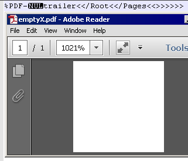
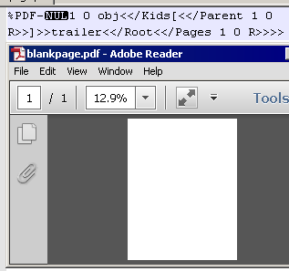
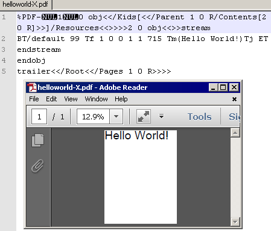
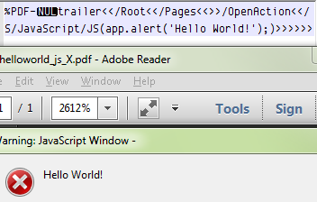
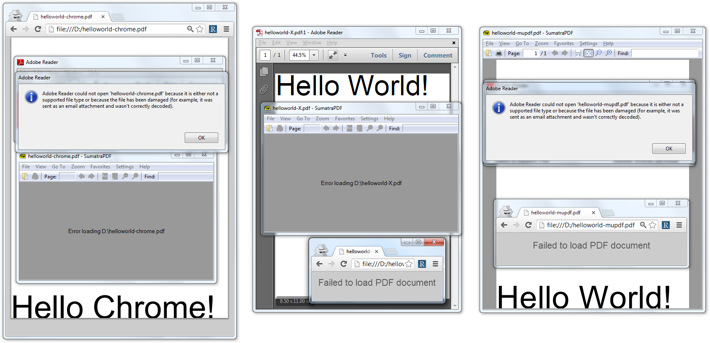

# PDF Tricks
This page is a summary of PDF tricks, either based on data encodings, JavaScript, or PDF structure, with hand-written proof-of-concepts.

<wiki:toc max_depth="3" />

*DISCLAIMER* The files are clean, and hand written by me, for better understanding and perfect clarity. However, because they use various tricks also present in malwares, they might be detected by your antivirus, or crash your usual program. They all work under Adobe Acrobat though, which is the point here.

 In short: they're odd, but they work, and they're clean.

for many more JavaScript tricks, check the [JavaScript Garden](http://bonsaiden.github.com/JavaScript-Garden/).


# encodings
any data (or string) can be encoded in various ways.

## hex
A string can be stored as hex.

 Example of `Hello World!` string, with each character encoded by its value in hexadecimal ([download](http://corkami.googlecode.com/svn-history/r480/trunk/misc/pdf/encode-hex.pdf)):

```
48656c6c6f20576f726c6421
```


## octal
another classic one, each character is encoded in octal.

 Example of `Hello World!` string, with each characters encoded by its value in octal ([download](http://corkami.googlecode.com/svn-history/r480/trunk/misc/pdf/encode-octal.pdf)):

```
\110\145\154\154\157\40\127\157\162\154\144\41\
```


## whitespaces between nibbles
so far so good, nothing too weird. However, it wouldn't be Adobe if something wasn't unexpected.

While it's common to separate hex numbers with space (`00 01 02...`), in a PDF, any kind of whitespace can be used (newline, tab, ...), and even between the 2 niblles of the same hex number.

 Example of `Hello World!` string, encoded as hexadecimal, with extra whitespace between the nibbles ([download](http://corkami.googlecode.com/svn-history/r480/trunk/misc/pdf/encode-hex-with-space.pdf)):

```
4
8
6


     5
6	c 6c 6f 		20


576f726c6421
```


## ASCII newlines
ASCII can be stored as ascii (hopefully), but newlines can be inserted too...

 Example of `Hello World!` string, stored as ASCII, with extra new lines characters ([download](http://corkami.googlecode.com/svn-history/r480/trunk/misc/pdf/encode-newline.pdf)):

```
[...]
}\
\
\
\
\
\
\
H\
e\
l\
\
\
\
\
\
l\
o\
 \
[...]
```


# structure
## truncated signature
theoretically `%PDF-1.[4-6]`, the signature can be truncated to ignore the last digit...

 Example of truncated header signature ([download](http://corkami.googlecode.com/svn-history/r480/trunk/misc/pdf/signature-shorter.pdf)):

```
%PDF-1.
```


## null signature
...but it can be actually even shorter, provided you insert a null character.

 Example of null-based header trick ([download](http://corkami.googlecode.com/svn-history/r480/trunk/misc/pdf/signature-null.pdf)):

```
%PDF-\0
```


## Names tree
A PDF can contain a Names tree, in which each element is sequentially evaluated. This way, a script can be split in various parts, without any obvious trigger such as OpenAction.

 Example of a JavaScript script, split into 2 parts in the Names tree ([download](http://corkami.googlecode.com/svn-history/r480/trunk/misc/pdf/structure-names.pdf)):

```
[...]
  /Names
[...]
       /Names[
            (1) <<
[...]
                  msg = "Hello";
[...]
            (2) <<
[...]
                  msg = msg + " World!";
                  app.alert(msg);
[...]
```


## no object
on Acrobat X, a valid PDF doesn't need an object.
 

 Example of a valid trailer-only, 36 bytes PDF, under Acrobat X ([download](http://corkami.googlecode.com/svn-history/r480/trunk/misc/pdf/emptyX.pdf)):

```
%PDF-\0trailer<</Root<</Pages<<>>>>>>
```


this trick doesn't work on previous version of Acrobat. For them, an object - even empty, and with no index - has to be present.

 Example of a valid, 48 bytes PDF, for Acrobat <=9 ([download](http://corkami.googlecode.com/svn-history/r480/trunk/misc/pdf/empty.pdf)):

```
%PDF-\0obj<<>>trailer<</Root<</Pages<<>>>>>>
```


## wrong tags
Unexpected tags are just ignored. this goes the same for tags with incorrect case.

 Example of a trailer with incorrectly cased tags ([download](http://corkami.googlecode.com/svn-history/r480/trunk/misc/pdf/structure-wrongcase.pdf)):

```
trailer
<<
/Root
    <</tYpE/caTaLOG/Pages 1 0 R>>
>>
```


## EOF
PDF is a format that supports incremental updates, so information can be written beyond the %EOF.

 Example of a PDF where objects and trailer are beyond the EOF ([download](http://corkami.googlecode.com/svn/!svn/bc/480/trunk/misc/pdf/structure-ignoredeof.pdf)):

```
[...]
%%EOF

% dummy object to make this PDF valid
[...]
15 0 obj
[...]
% the trailer is not allowed to be before all other objects
trailer
<<
/Root<</Pages 1 0 R>>
>>

1 0 obj
<</Kids[<</Parent 1 0 R/Contents[2 0 R]>>]
[...]

2 0 obj
<<>>
stream
BT/default 20 Tf 1 0 0 1 1 715 Tm(this text and the PDF objects are stored beyond the %%EOF tag)Tj ET
[...]
```


## linearized
PDF are parsed bottom-up by default, except if the first object (even a dummy non-referenced object) contains the _/Linearized_ tag (with a dummy value)

 Example of a PDF parsed either bottom-up or top-down (if linearized) ([download](http://corkami.googlecode.com/svn/!svn/bc/480/trunk/misc/pdf/structure-parsingdirection.pdf)):

```
[...]
% inserting/removing a dummy first object will change the parsing direction
12 0 obj <<<>>
[...]
31415 0 obj
<< /Linearized -42 >>
endobj
[...]
2 0 obj
<<>>
stream
BT/default 35 Tf 1 0 0 1 1 715 Tm(this PDF has been parsed top-down)Tj ET
endstream
endobj
[...]
20 0 obj
<<>>
stream
BT/default 35 Tf 1 0 0 1 1 715 Tm(this PDF has been parsed bottom-up)Tj ET
endstream
endobj
[...]
% if this trailer is taken in account, it will display 'Top-down'
trailer
<<
/Root
  <<
  /Pages 1 0 R
  >>
>>
[...]
% if this trailer is taken in account, it will display 'Bottom-up'
trailer
<<
/Root
  <<
  /Pages 10 0 R
  >>
>>
```


# JavaScript-based encodings
Here are a few other encoding tricks, that use javascript (not necessarily specific to Acrobat's)

## concatenation
the simplest tricks of all for strings in Javascript, split into parts, then concatenate back.

 Example of a `Hello World!` string concatenated before display ([download](http://corkami.googlecode.com/svn/!svn/bc/480/trunk/misc/pdf/js-concat.pdf)):

```
[...]
      B="Hell";
      on="o ";
      jour="World!";
      app.alert(B + on + jour);
[...]
```


## replace
simple obfuscation, add some extra character/switch then replace/restore them before use.

 Example of `Hello World!` string, obfuscated with extra characters ([download](http://corkami.googlecode.com/svn-history/r480/trunk/misc/pdf/js-replace.pdf)):

```
"zHzzezzlzlzozzzzz zWozrzldz!").replace(/z/g,"")
```


## escaping
another standard javascript obfuscation, replace characters with escaped ones.

 Example of _Hello World!_ string, encoded with javascript escaping ([download](http://corkami.googlecode.com/svn-history/r480/trunk/misc/pdf/js-unescape.pdf)):

```
unescape("%48%65%6C%6C%6F%20%57%6F%72%6C%64%21")
```


## base encoding
like CAFEBABE can be read as a word or as a hex number, any uppercase word can be written as a base32 (32 or less, depending on the last (in the alphabet) used character) numbers.

 Example of a `HELLO WORLD!` string, with each word encoded as a number, in different bases ([download](http://corkami.googlecode.com/svn-history/r480/trunk/misc/pdf/js-number.pdf)):

```
(6873049).toString(25) + " " + (38842069).toString(33) + "!"
```


# JavaScript-based tricks
## eval
A classic: some code can be built in a string, then executed via evaluation.

 Example of a string of code being evaluated ([download](http://corkami.googlecode.com/svn-history/r480/trunk/misc/pdf/js-eval.pdf)):

```
[...]
     eval('app.alert("Hello World!");');
[...]
```


## substring
A function such as _alert_ can be called, not only directly, but also as a substring of its parent object, _app_ in our example.

 Example of a JavaScript function called by a string reference from its parent ([download](http://corkami.googlecode.com/svn-history/r480/trunk/misc/pdf/js-substring.pdf)):

```
[...]
     app["alert"]("Hello World!");
[...]
```


## array
the previous example can be extended with a fake array with fake entries, which makes the actual executed function harder to spot.

 Example of a code string evaluated via a fake array reference ([download](http://corkami.googlecode.com/svn-history/r480/trunk/misc/pdf/js-array.pdf)):

```
[...]
     e = ("fake1")[("fake2", "eval")]
     e('app.alert("Hello World!");');
[...]
```


## callee
A JavaScript function can access its own code, and use it for anything. Thus, any modification might prevent the function to work correctly: typically, such functions use their code as a key for some decryption.

 Example of a decryption function, using its own code as decryption key ([download](http://corkami.googlecode.com/svn-history/r480/trunk/misc/pdf/js-callee.pdf)):

```
[...]
      function decrypt(cipher)
[...]
            key = arguments.callee.toString();
[...]
            return plaintext;
}
[...]
      app.alert(decrypt(unescape(".%10%02%0F%1BI8%01R%08%01B")));
[...]
```


# JavaScript + PDF

these tricks are hiding some information in one of the various component of the PDF, and retrieving that information via JavaScript.

## info
a PDF's trailer can contain an _Info_ dictionary, whose elements' contents can be retrieved via JavaScript via the _info_ object's properties.

 Example of a string being stored as element of a trailer's Info dictionary ([download](http://corkami.googlecode.com/svn-history/r480/trunk/misc/pdf/js-info.pdf)):

```
[...]
      /Info <</Author(Hello) /Title( World) /Producer( !)>>
[...]
      app.alert(info.author + info.title + info.producer);
[...]
```


## annots
Similarly, a PDF page can contain an annotation, which content can be retrieved by _getAnnots_ on the specific page.

 Example of a string being stored as a page's annotation's subject ([download](http://corkami.googlecode.com/svn/!svn/bc/480/trunk/misc/pdf/js-annots.pdf)):

```
[...]
    /Annots
[...]
         /Subj (Hello World!)
[...]
      d = app.doc;
      d.syncAnnotScan();
      a = d.getAnnots({ nPage: 0 });
      app.alert(a[0].subject);
[...]
```


## getfield
An _!AcroForm Widget_ can contain some data and value, which can be retrieved via the _getField_ function.

 Example of a string stored in an AcroForm Widget ([download](http://corkami.googlecode.com/svn-history/r480/trunk/misc/pdf/js-getfield.pdf)):

```
[...]
  /AcroForm
[...]
        /Subtype/Widget
        /T(mydata)        % this is the name
        /V(Hello World!)  % this is the value
[...]
      app.alert(this.getField('mydata').value);
[...]
```


## form event
A form can contain a template, with an event on its field, that contains a script.

 Example of a JavaScript stored in the field event of a form ([download](http://corkami.googlecode.com/svn-history/trunk/misc/pdf/formevent_js.pdf)):

```
[...]
1 0 obj <<>>
[...]
<xdp:xdp xmlns:xdp="http://ns.adobe.com/xdp/">
[...]
<template>
    <subform name="_">
        <pageSet/>
        <field id="Hello World!">
            <event activity="initialize">
                <script contentType='application/x-javascript'>
                    app.alert(this.id);
[...]

trailer <<
    /Root <<
        /AcroForm <<
[...]
            /XFA 1 0 R
[...]
```


## anti-emulators
On top of standard JavaScript, it's possible, via Acrobat specificities, to determine if we're in the real program or in an emulator.
### initial values
some Adobe specific global variables are initialized with default values, so checking them might stop an emulator.

 Example of Acrobat JavaScript code that checks initial values as an anti-emulator ([download](http://corkami.googlecode.com/svn/!svn/bc/480/trunk/misc/pdf/js-trick-initvalues.pdf)):

```
[...]
      if ((app)
        && (event.target.zoomType.toString() == 'FitPage'))
[...]
```


### global variables
global variables show a different behavior as opposed to normal ones: their type is no updated, even if you explicitely assign them new values.

 Example of Acrobat JavaScript code that sets global variables, and checks the result ([download](http://corkami.googlecode.com/svn/!svn/bc/480/trunk/misc/pdf/js-trick-globals.pdf)):

```
[...]
      hidden=0;  // global
      hidden_=0; // not global
      if ((hidden_ === 0) && (hidden !== 0))
          app.alert("nothing unusual detected.");
[...]
```


# Minimalists PDF
see earlier in the page for PDFs as small as possible, but containing nothing.
## Page
to actually contain a page, an object, defining its kid as its parent, should be referenced in trailer/Root/Pages.
 

 Example of a minimalist PDF with a page ([download](http://corkami.googlecode.com/svn/!svn/bc/480/trunk/misc/pdf/blankpage.pdf)):

```
%PDF-\01 0 obj<</Kids[<</Parent 1 0 R>>]>>trailer<</Root<</Pages 1 0 R>>>>
```


## Page + Text
To define a text, the page should have empty resources, and a content, made of the text itself.
 

 Example of a minimalist PDF with page + text, under Acrobat <=9 ([download](http://corkami.googlecode.com/svn/!svn/bc/480/trunk/misc/pdf/helloworld.pdf)):

```
%PDF-\01 0 obj<</Kids[<</Parent 1 0 R/Contents[2 0 R]>>]/Resources<<>>>>2 0 obj<<>>stream
BT/default 99 Tf 1 0 0 1 1 715 Tm(Hello World!)Tj ET
endstream
trailer<</Root<</Pages 1 0 R>>>>
```


Note this object doesn't have to have an _endobj_ tag. On the contrary, it's required under Acrobat X.

 Example of a minimalist PDF with page + text, under Acrobat X ([download](http://corkami.googlecode.com/svn/!svn/bc/480/trunk/misc/pdf/helloworld-X.pdf)):

```
%PDF-\01 0 obj<</Kids[<</Parent 1 0 R/Contents[2 0 R]>>]/Resources<<>>>>2 0 obj<<>>stream
BT/default 99 Tf 1 0 0 1 1 715 Tm(Hello World!)Tj ET
endstream
endobj
trailer<</Root<</Pages 1 0 R>>>>
```


## JavaScript
to be able to use JavaScript, a PDF just needs to be empty (see above), with an _OpenAction_ in the _trailer/root_.
 

 Example of a minimalist PDF using JavaScript, under Acrobat <=9 ([download](http://corkami.googlecode.com/svn/!svn/bc/480/trunk/misc/pdf/helloworld_js.pdf)):

```
%PDF-\0obj<<>>trailer<</Root<</Pages<<>>/OpenAction<</S/JavaScript/JS(app.alert('Hello World!');)>>>>>>
```


 Example of a minimalist PDF using JavaScript, under Acrobat X ([download](http://corkami.googlecode.com/svn/!svn/bc/480/trunk/misc/pdf/helloworld_js_X.pdf)):

```
%PDF-\0trailer<</Root<</Pages<<>>/OpenAction<</S/JavaScript/JS(app.alert('Hello World!');)>>>>>>
```


# Corrupted stream
if a FlatEncoded stream is truncated or corrupted, it will be taken as is until the error - and still interpreted (typically, such a stream would be totally discarded).

An easy way to get the original corrupted stream to decompress like Reader would, is to actually get Reader to decompress it - without executing it - by pruning it into a template PDF with attachment. This way, Adobe Reader will actually be the one decompressing the stream, but not execute it.

WARNING: it will not work if the PDF is encrypted - it should be decrypted first.

#  readers compatibility 
using several degrees of PDF malformations on one-page 'Hello world' documents, you can test your PDF tools 'robustness':
 1. [naive](PoCs/helloworld-naive.pdf) is a naive PDF, extremely standard.
 1. [generic](PoCs/helloworld-generic.pdf) doesn't contain stream lengths, xref, and EOF, which are the most standard malformations.
 1. slightly linux specific
  1. [MuPDF](PoCs/helloworld-mupdf.pdf) contains *NO* PDF signature, incomplete Tf parameters, and fewer elements, yet is fully supported by many readers (Evince, ubuntu preview)
  1. [sumatra](PoCs/helloworld-sumatra.pdf) is similar to MuPDF, except it contains no endobj, and fewer objects.
 1. adobe reader specific
  1. [reader-X](PoCs/helloworld-X.pdf) contains a *truncated* signature, specific to Adobe. Also, *no* font definition is required.
  1. [reader](PoCs/helloworld.pdf) is the same, but it also miss an endobj on the stream object.
 1. [chrome specific](PoCs/helloworld-chrome.pdf)
  1. truncated `%PDF` signature
  1. (disabled) recursive object
  1. bogus trailer
  1. trailer in a bogus object, in a comment

| software | naive  | generic | mupdf | sumatra | reader | readerX |
|-|  |  |  |  |  |  |
| [PDF.JS](http://mozilla.github.com/pdf.js/web/viewer.html) | Ok | fail | fail | fail | fail | fail |
| |  |  |  |  |  |  |
| Chrome | Ok | Ok | fail | fail | fail | fail |
| Mountain Lion | Ok | Ok | fail | fail | fail | fail |
| Safari | Ok | Ok | fail | fail | fail | fail |
| Goodreader | warning then Ok | warning then Ok | fail | fail | fail | fail |
| |  |  |  |  |  |  |
| Adobe Reader 7 | Ok | Warning then Ok | fail | fail | Ok | Warning then Ok |
| Adobe Reader 8 | Ok | Ok | fail | fail | Ok | Ok |
| Adobe Reader 9 | Ok | Ok | fail | fail | fail | Ok |
| Adobe Reader X | Ok | Ok | fail | fail | fail | Ok |
| |  |  |  |  |  |  |
| Evince | Ok | Ok | Ok | fail | fail | fail |
| muPDF  | Ok | Ok | no text | Ok | fail | fail |
| Sumatra | Ok | Ok | Ok | Ok | fail | fail |
| Ubuntu preview | Ok | Ok | Ok | fail | fail | fail |
| |  |  |  |  |  |  |



##  a schizophrenic PDF 
a working [PDF](PoCs/standard.pdf), giving different results in Sumatra, Chrome reader and Adobe Reader, with oddities specific to each viewer.


# PDF Secrets
A study on how to reveal or hide secrets in PDF documents.

Presented at RaumZeitLabor on the 2014/05/17 ([PoCs](PoCs/PDFSecrets))

<wiki:gadget url="https://corkami.googlecode.com/svn/wiki/gadgets/pdfsecrets_slideshare.xml" width=595 height=497 border=0/>

<wiki:video url="http://www.youtube.com/watch?v=JQrBgVRgqtc"/>

# References
 * [Didier Stevens](http://blog.didierstevens.com/2008/04/29/pdf-let-me-count-the-ways/)
 * [Jonas Magazinius](http://www.chalmers.se/cse/SV/personal/magazinius-jonas)
 * [Julia Wolf](http://events.ccc.de/congress/2010/Fahrplan/events/4221.en.html)
 * [Kazumasa Itabashi](http://www.symantec.com/connect/blogs/portable-document-format-malware)
 * [Sebastian Porst](http://blog.zynamics.com/2010/07/13/recon-slides-how-to-really-obfuscate-your-pdf-malware/)
 