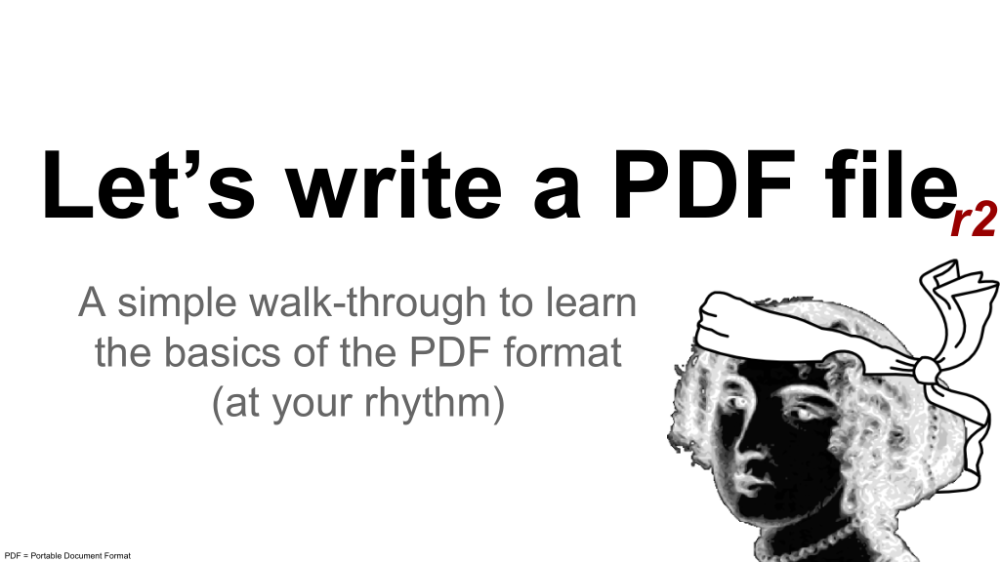
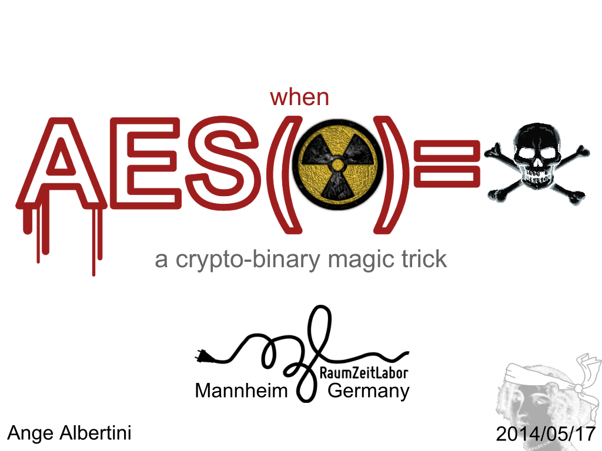
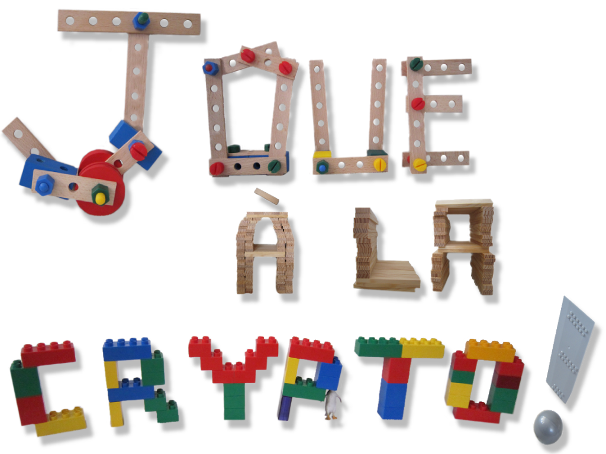

# Talks, keynotes, tutorials, workshops, articles, podcasts...

Faster alone, further together.

[Chronological Youtube playlist](https://www.youtube.com/playlist?list=PL2-EpKoPE60Uyi5X6NMeiROVi8hm33sW3) 
[SpeakerDesk](https://speakerdeck.com/ange)

# Contents

- [Contents](#contents)
- [Brainteasers](#brainteasers)
- [For kids](#for-kids)
- [Tools-assisted speedruns](#tools-assisted-speedruns)
- [Arcade games preservation (via hacking)](#arcade-games-preservation-via-hacking)
- [Drawing](#drawing)
- [Keynotes](#keynotes)
- [File formats](#file-formats)
  - [Portable Document Format](#portable-document-format)
  - [Portable Executable](#portable-executable)
  - [with cryptography](#with-cryptography)
    - [AngeCryption](#angecryption)
    - [Hash collisions](#hash-collisions)
    - [TimeCryption](#timecryption)
  - [Digital preservation](#digital-preservation)
  - [Visualisation & dissection](#visualisation--dissection)
- [Academic papers](#academic-papers)
- [Articles](#articles)
  - [Notable appearances](#notable-appearances)
  - [PoC or GTFO](#poc-or-gtfo)

# Brainteasers

**A challenge in your pocket: an introduction to brainteasers** HackPra 2013
[slides](https://speakerdeck.com/ange/a-challenge-in-your-pocket-an-introduction-to-brainteasers) /
[video](http://www.youtube.com/watch?v=hg7A7YIEWbU)

# For kids

**How people can create better video games** Hack.lu 2015
[slides](https://speakerdeck.com/ange/hacks-in-video-games)
 Hacking: spend time to understand how things really work (and get awesome results)

# Tools-assisted speedruns

**TASBot - the perfectionist** 2016 DEF CON
 w/ [dwangoAC](https://twitter.com/mrtasbot),
[slides](https://speakerdeck.com/ange/tasbot-the-perfectionist) /
[video](https://www.youtube.com/watch?v=2kj5ZmoTckI)

# Arcade games preservation (via hacking)

**Preserving arcade games** Exceptional games, exceptional security, exceptional hacking 
[slides](https://speakerdeck.com/ange/preserving-arcade-games-31c3) /
[live animated prezo (1Gb)](https://archive.org/details/arcade31c3) /
[video](https://www.youtube.com/watch?v=vg7LPcFUxg8) /
[video (fr)](https://www.youtube.com/watch?v=d2X0YyxHg5Q)

<!--
[REcon 2013](https://www.youtube.com/watch?v=R9iQGTOco0M)

-->

- 2013: Recon, T2
- 2014: Nuit du Hack, RaumZeitLabor , CCC
- 2015: HackPra All Stars

# Drawing

**an introduction to Inkscape** 2017 (workshop) DEFCON Zürich
[slides](https://speakerdeck.com/ange/an-introduction-to-inkscape)

# Keynotes

<!-- -->

**Beyond your studies** HackPra 2018, ESIEA 2019, University of Warwick 2021
[slides](https://speakerdeck.com/ange/beyond-your-studies-v2) /
[video](https://www.youtube.com/watch?v=a0V7bAzw5sE)<!-- / [video v1](https://www.youtube.com/watch?v=Prgv9pNvy24) -->
 about your future - as a student or young professional.

**Infosec & Failures** Hack.lu 2017
[slides](https://speakerdeck.com/ange/infosec-and-failures) /
[video](https://www.youtube.com/watch?v=erZ2JlfTtcE)
 about you.

**Connecting Communities** RMLLSec 2016
[slides](https://speakerdeck.com/ange/connecting-communities) /
[video](https://www.youtube.com/watch?v=6DsJI1rcOZk)
 about connecting with your peers.

**Education & Communication** Hack.lu 2018
[slides](https://speakerdeck.com/ange/education-and-communication) /
[video](https://www.youtube.com/watch?v=Y_BBQlR-SUo)
 about your surroundings.

**You are *not* an idiot** NorthSec 2021
[slides](https://speakerdeck.com/ange/you-are-not-an-idiot) /
[video](https://www.youtube.com/watch?v=Iu70J49bPlE&t=20869s)
 about things you could get wrong in general.

# File formats

**Messing with binary formats** 2013 44Con, SSTIC
[slides](https://speakerdeck.com/ange/messing-with-binary-formats) /
[video](https://vimeo.com/channels/44con2013/109380801)

**Schizophrenic files** 2014 Area41, MRMCD
[slides](https://speakerdeck.com/ange/schizophrenic-files) /
[video](https://www.youtube.com/watch?v=9Hm0obaDC58)
 w/ [Gynvael Coldwind](https://twitter.com/gynvael)

**Funky file formats** CCC 2014
[slides](https://speakerdeck.com/ange/funky-file-formats-31c3) /
[video](https://www.youtube.com/watch?v=hdCs6bPM4is) /

**Funky file formats** NoLimitSecu, March 2015
[\[podcast\] (fr)](https://www.nolimitsecu.fr/ange-albertini-funky-file-formats/)

**Trusting files (and their formats)** Hack.lu 2015
[slides](https://speakerdeck.com/ange/trusting-files)

**Caring for file formats** Troopers 2016
[slides](https://speakerdeck.com/ange/caring-for-file-formats) /
[video](https://www.youtube.com/watch?v=mqioXYpyYhM)

**Binary stuff** Gynvael ColdWind livestream, 13 Dec. 2017
[video](https://www.youtube.com/watch?v=-dyLxsr_f_w?t=862s)

**Formats de fichiers: structures et conséquences** ESIEA, November 2019
[Groupe de Travail "Sécurité des Systèmes, des Logiciels et des Réseaux"](https://gtsslr19.sciencesconf.org/),
[slides](https://speakerdeck.com/ange/formats-de-fichiers-decisions-et-consequences)

**Generating weird files - an introduction to Mitra** Pass the Salt 2021
[slides](https://speakerdeck.com/ange/generating-weird-files) /
[video](https://www.youtube.com/watch?v=96FiTaAiUk8&t=7877s)
 polymocks, polyglots, near polyglots

**Talking about file formats** LiveOverFlow livestream, 26th Aug. 2021
[YouTube](https://www.youtube.com/watch?v=CB_WIjxq1To) / [Twitch](https://www.twitch.tv/videos/1130169550)

## Portable Document Format

**PDF secrets** 2014, RaumZeitLabor, MRMCD
[slides](https://speakerdeck.com/ange/pdf-secrets-v2) /
[video](https://media.ccc.de/v/MRMCD2014_-_6007_-_en_-_grossbaustelle_ber_-_201409051830_-_pdf_101_pdf_secrets_-_ange_albertini)

**an overview of PDF potential leaks** 2015
[slides](https://speakerdeck.com/ange/an-overview-of-pdf-potential-leaks)

**Advanced PDF tricks** (workshop) Troopers 2015
[slides](https://speakerdeck.com/ange/advanced-pdf-tricks) /
[video](https://www.youtube.com/watch?v=k9g9jZdjRcE)
 w/ [Kurt Pfeifle](https://twitter.com/pdfkungfoo)

**Let's write a PDF file** (tutorial) 2017
[slides](https://speakerdeck.com/ange/lets-write-a-pdf-file)

## Portable Executable

**x86 & PE** 2011, HashDays, BerlinSides
[slides](https://speakerdeck.com/ange/x86-and-p) /
[video](https://www.youtube.com/watch?v=MJvsshovITE)

**a bit more of PE** Hack in Paris 2012
[slides](https://speakerdeck.com/ange/a-bit-more-of-pe) /
[video](https://www.youtube.com/watch?v=3duSgr5b1yc)

**Binary art: Byte-ing the PE that fails you** Hashdays 2012
[slides](https://speakerdeck.com/ange/byte-ing-the-pe-that-fails-you) /
[video](https://www.youtube.com/watch?v=kibEcaG0zCk)

**Exploring the PE format** (workshop) 44con 2013
[slides](https://speakerdeck.com/ange/workshop-exploring-the-portable-executable-format)

## with cryptography

=☠.pdf)

### AngeCryption

**when AES(☢) = ☠**, May 2014
[slides](https://speakerdeck.com/ange/when-aes-equals-episode-v) /
[video](http://www.youtube.com/watch?v=wbHkVZfCNuE)

**Let's play with crypto** June 2014 RaumZeitLabor, RMLL, MRMCD
[slides (en)](https://speakerdeck.com/ange/lets-play-with-crypto) /
[slides (fr)](https://speakerdeck.com/ange/joue-a-la-crypto-french) /
[video (fr)](https://www.youtube.com/watch?v=iIesDpv9F4s) /
[video](https://media.ccc.de/v/MRMCD2014_-_6006_-_en_-_grossbaustelle_ber_-_201409052030_-_let_s_play_with_crypto_-_ange_albertini) 
*AngeCryption* / *TrueCrypt* / *polyglots*

**Hide Android Applications in Images** BlackHat Europe 2014,
[slides](https://www.blackhat.com/docs/eu-14/materials/eu-14-Apvrille-Hide-Android-Applications-In-Images.pdf) / [video](https://www.youtube.com/watch?v=hajOlvLhYJY)
 w/ [Axelle Apvrille](https://twitter.com/cryptax)

### Hash collisions

**SHA-1 backdooring and exploitation**, BSidesLV 2014
[slides](https://speakerdeck.com/ange/sha-1-backdooring-and-exploitation) /
[video](https://www.youtube.com/watch?v=GHY3dv42dz4)
 w/ [Maria Eichlseder](https://twitter.com/MariaEichlseder), Florian Mendel, Martin Schäffler, [Jean-Philippe Aumasson](https://twitter.com/veorq)
 MalSHA1 collisions

**Exploiting hash collisions** w/ [Marc Stevens](https://twitter.com/realhashbreaker), BlackAlps 2017
[slides](https://speakerdeck.com/ange/exploiting-hash-collisions) /
[video](https://www.youtube.com/watch?v=Y-oJWEYKVLA)
 MalSHA1, Shattered, MD5 collisions & hashquines

**KILL MD5 - Demystifying hash collisions** w/ [Marc Stevens](https://twitter.com/realhashbreaker),
[slides](https://speakerdeck.com/ange/kill-md5)
- Pass the Salt 2019
[video](https://passthesalt.ubicast.tv/videos/kill-md5-demystifying-hash-collisions/)
- Hack.lu 2019
[video](https://www.youtube.com/watch?v=JXazRQ0APpI)

**CollTris - Hash collisions exploitations** workshop w/ [Marc Stevens](https://twitter.com/realhashbreaker), 
[slides](https://speakerdeck.com/ange/colltris) /
[video](https://www.youtube.com/watch?v=BcwrMnGVyBI)

- 2019/07/02 150p, Pass The Salt
- 2019/07/24 199p, Google
- 2019/08/19 208p, Google
- 2019/10/23 222p, Hack.lu
- 2019/11/07 225p, Black Alps
- 2019/12/03 229p, Google

**Collisions de hash** NoLimitSecu #249, December 2019
[\[podcast\] (fr)](https://www.nolimitsecu.fr/collisions-de-hash/)

**Inside Out - Abusing archive file formats**
Generic and reusable hash collisions of Gzip and ZIP(XML) archives. Pass The Salt 2022
[slides](https://speakerdeck.com/ange/inside-out-abusing-archive-file-formats) /
[video](https://www.youtube.com/watch?v=VPQHMNUxm8c)

### TimeCryption

**TimeCryption - clean now, malicious later**.
Abusing one-time pads with binary polyglots. DEFCON CH 2021 w/ [Stefan Kölbl](https://twitter.com/kste_),
[slides](https://speakerdeck.com/ange/timecryption) /
[video](https://www.youtube.com/watch?v=liancIA1m9w)

**How to Abuse and Fix Authenticated Encryption Without Key Commitment**.
USENIX Security 2022, presented by [Stefan Kölbl](https://twitter.com/kste_),
[slides](https://www.usenix.org/system/files/sec22_slides-albertini.pdf) /
[video](https://www.youtube.com/watch?v=VazqgsBwzOY)

## Digital preservation

**PDF: myths vs facts**
["When is a PDF not a PDF?" DPC briefing](https://www.dpconline.org/events/past-events/preserving-documents-forever-when-is-a-pdf-not-a-pdf), Oxford university, July 2015
[slides](https://speakerdeck.com/ange/pdf-myths-vs-facts)

**the Challenges of file formats**
[Nestor Praktikertag](http://www.langzeitarchivierung.de/Subsites/nestor/DE/Veranstaltungen/TermineNestor/praktikertag2017.html), Kiel, July 2017
[slides](https://speakerdeck.com/ange/the-challenges-of-file-formats)

**Improving file formats**
-, May 2019
[slides](https://speakerdeck.com/ange/improving-file-formats-from-to)

**Technical challenges with file formats**
DPC CyberSec & DigiPres event, Dec 2022
[slides](https://speakerdeck.com/ange/technical-challenges-with-file-formats)

## Visualisation & dissection

**Binary art - funky PoCs & visual docs** Insomni'hack, Geneva,  March 2014,
[slides](slides/1403-BinaryArtFunkyPoCsAndVisualDocs.pdf#page=44)

**No more dumb hex! Rethinking binary tooling** Troopers 2019,
[slides](https://speakerdeck.com/ange/no-more-dumb-hex) /
[video](https://www.youtube.com/watch?v=264OmDG8m7M)
 w/ [Rafał Hirsz](https://twitter.com/HDevo)

# Academic papers

[Malicious Hashing: Eve’s Variant of SHA-1](https://eprint.iacr.org/2014/694), Aug 2014 
Ange Albertini, [Jean-Philippe Aumasson](https://twitter.com/veorq), [Maria Eichlseder](https://twitter.com/MariaEichlseder), Florian Mendel, and Martin Schlaeffer 
*hash collisions*

[Fillory of PHY: Toward a Periodic Table of Signal Corruption Exploits and Polyglots in Digital Radio](https://www.usenix.org/conference/woot16/workshop-program/presentation/bratus), WOOT 2016 
[Sergey Bratus](https://twitter.com/sergeybratus), [Travis Goodspeed](https://twitter.com/travisgoodspeed), Ange Albertini, Debanjum S. Solanky 
*polyglots*

[The first collision for full SHA-1](https://eprint.iacr.org/2017/190), Feb 2017 
[Marc Stevens](https://twitter.com/realhashbreaker), Elie Bursztein, [Pierre Karpman](https://twitter.com/shab0y), Ange Albertini, Yarik Markov 
*hash collisions*

[How to Abuse and Fix Authenticated Encryption Without Key Commitment](https://eprint.iacr.org/2020/1456), Nov 2020 - [Dec 2021](slides/2112-AbuseAE.pdf)<!-- [Nov 2020](slides/2011-AbuseAE.pdf) / [Jun 2021](slides/2106-AbuseAE.pdf) / [Oct 2021](slides/2110-AbuseAE.pdf) --> 
Ange Albertini, [Thai Duong](https://twitter.com/XorNinja), Shay Gueron, [Stefan Kölbl](https://twitter.com/kste_), Atul Luykx, [Sophie Schmieg](https://twitter.com/SchmiegSophie) 
*key commitment, timecryption*

 - Cryptography FM - Episode 10 \[podcast\]: [Exploiting Authenticated Encryption](https://www.cryptography.fm/10), Nov 2020, w/ [Stefan Kölbl](https://twitter.com/kste_)

# Articles

2019/08 [Adding any external data to any PDF](https://pagedout.institute/download/PagedOut_001_beta1.pdf#page=16), [Paged Out!](https://pagedout.institute/) p17 (=> [extended version](PagedOut/README.md))

2020/07 Exploitations de collisions MD5, [Misc Hors série 21](https://boutique.ed-diamond.com/les-hors-series/1518-misc-hs-21.html) p118 
*hash collisions*

## Notable appearances

[Programista 2013/11](https://programistamag.pl/programista-112013-18-spis-tresci/), p102-103

## PoC or GTFO

In [Proof of Concept or Get the F\*ck Out](https://github.com/angea/pocorgtfo/blob/master/README.md)

2013/10
- 01:04 [Making a Multi-Windows PE](https://archive.org/stream/Pocorgtfo01#page/n8/mode/1up)

2013/12
- 02:08 [This OS is also a PDF](https://archive.org/stream/Pocorgtfo02#page/n20/mode/1up)

2014/03
- 03:03 [This PDF is a JPEG; or, This Proof of Concept is a Picture of Cats](https://archive.org/stream/pocorgtfo03#page/n7/mode/1up)
- 03:11 [A Binary Magic Trick, Angecryption](https://archive.org/stream/pocorgtfo03#page/n36/mode/1up), w/ [Jean-Philippe Aumasson](https://twitter.com/veorq)

2014/06
- 04:11 [This Encrypted Volume is also a PDF; or, A Polyglot Trick for Bypassing TrueCrypt Volume Detection](https://archive.org/stream/pocorgtfo04#page/n41/mode/1up)
- 04:12 [How to Manually Attach a File to a PDF](https://archive.org/stream/pocorgtfo04#page/n43/mode/1up)

2014/08
- 05:12 [A cryptographer and a binarista walk into a bar](https://archive.org/stream/pocorgtfo05#page/n47/mode/1up), w/ [Maria Eichlseder](https://twitter.com/MariaEichlseder) *hash collisions*

2014/11
- 06:04 [This TAR archive is a PDF! (as well as a ZIP, but you are probably used to it by now)](https://archive.org/stream/pocorgtfo06#page/n14/mode/1up)

2015/03
- 07:06 [Funky Files, the Novella!](https://archive.org/stream/pocorgtfo07#page/n17/mode/1up)

2016/01
- 10:03 [Exploiting Pokémon in a Super GameBoy](https://archive.org/stream/pocorgtfo10#page/n6/mode/1up) by [dwangoAC](https://twitter.com/@MrTASBot), Ilari, [p4plus2](https://twitter.com/@p4plus2) *contribution*
- 10:04 [Pokéglot!](https://archive.org/stream/pocorgtfo10#page/n23/mode/1up) by [dwangoAC](https://twitter.com/@MrTASBot), Ilari, [p4plus2](https://twitter.com/@p4plus2) *contribution*
- 10:07 [Apple II Copy Protections](https://archive.org/stream/pocorgtfo10#page/n75/mode/1up) by [Peter Ferrie](https://twitter.com/@a2_qkumba) *contribution*

2016/03
- 11:05 [Defeating E7 Protection on the Apple II Platform](https://archive.org/stream/pocorgtfo11#page/n14/mode/1up) by [Peter Ferrie](https://twitter.com/@a2_qkumba) *contribution*
- 11:10 [Ben "bushing" Byer Memorial](https://archive.org/stream/pocorgtfo11#page/n37/mode/1up) by [fail0verflow](https://twitter.com/fail0verflow) *contribution*

2016/06
- 12:04 [Comma Chameleon](https://archive.org/stream/pocorgtfo12#page/n13/mode/1up) by [Krzysztof Kotowicz](https://twitter.com/@kkotowicz), [Gábor Molnár](https://twitter.com/@molnar_g) *contribution*

2016/10
- 13:02 [Reverse Engineering Star Raiders](https://archive.org/stream/pocorgtfo13#page/n4/mode/1up) by Lorenz Wiest *contribution*

2017/03
- 14:09 [Postscript that shows its own MD5](https://archive.org/stream/pocorgtfo14#page/n45/mode/1up) by [Gregor "Greg" Kopf](https://twitter.com/@teh_gerg) *contribution*
- 14:10 [A PDF That Shows Its Own MD5](https://archive.org/stream/pocorgtfo14#page/n49/mode/1up) by [Mako](https://twitter.com/@makomk) *contribution*
- 14:11 [This GIF shows its own MD5!](https://archive.org/stream/pocorgtfo14#page/n52/mode/1up) by [Kristoffer "spq" Janke](https://twitter.com/@__spq__) *contribution*
- 14:12 [This PDF is an NES ROM that prints its own MD5 hash!](https://archive.org/stream/pocorgtfo14#page/n55/mode/1up) by [Evan Sultanik](https://twitter.com/@ESultanik), [Evan Teran](https://twitter.com/@evan_teran) *contribution*

2017/06
- 15:02 [Pier Solar and the Great Reverser](https://archive.org/stream/pocorgtfo15#page/n4/mode/1up) by [Brandon L. Wilson](https://twitter.com/@brandonlwilson) *contribution*
- 15:04 [Text2COM Silver Jubilee Edition](https://archive.org/stream/pocorgtfo15#page/n15/mode/1up) by [Saumil Shah](https://twitter.com/@therealsaumil), Udayan Shah *contribution*
- 15:06 [Gumball](https://archive.org/stream/pocorgtfo15#page/n24/mode/1up) by [4am](https://twitter.com/@a2_4am), [Peter Ferrie](https://twitter.com/@a2_qkumba) *contribution*
- 15:12 [Nail in the Java Key Store Coffin](https://archive.org/stream/pocorgtfo15#page/n88/mode/1up) by [Tobias "Floyd" Ospelt](https://twitter.com/@floyd_ch) *contribution*

2018/06
- 18:10 [Easy SHA-1 Colliding PDFs with PDFLaTeX](https://archive.org/stream/pocorgtfo18#page/n62/mode/1up) *hash collisions*

2019/03
- 19:05 [An MD5 Pileup](https://archive.org/stream/pocorgtfo19#page/n20/mode/1up), w/ [Marc Stevens](https://twitter.com/realhashbreaker) *hash collisions*

<!-- pandoc -s -f gfm -t html talks.md -o talks.htm -->
